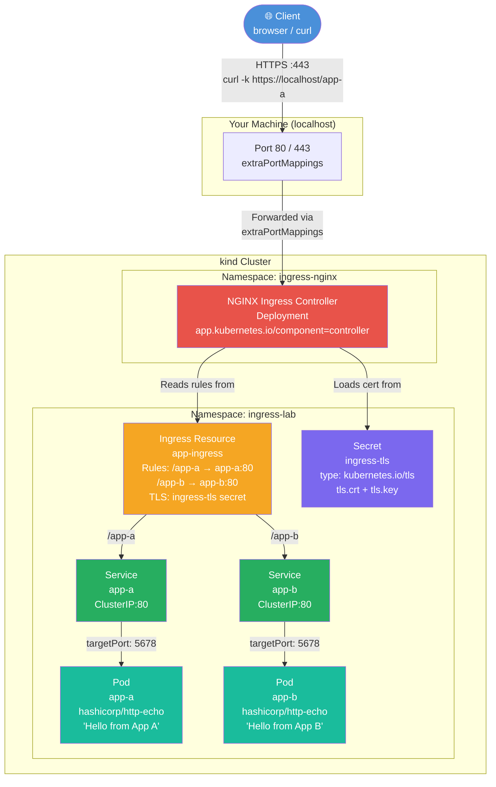

# Hands-On 10 — Route Traffic Like a Pro

## What This Lab Is About

A Service gives your pod a stable internal IP — but it's invisible to the outside world. To expose your app to external traffic, you need an **Ingress**. Ingress is the single, controlled entry point into your cluster — a reverse proxy that routes requests to the right backend based on URL path or hostname.

This lab teaches you how external traffic flows into Kubernetes, how NGINX Ingress Controller works as the actual proxy, and how TLS termination protects your apps without touching a single line of app code.

> "One Ingress. One IP. Any number of backends. This is how real platforms are built."

---

## Concepts Covered

- **NGINX Ingress Controller** — the reverse proxy pod that enforces routing rules
- **IngressClass** — tells Kubernetes which controller should handle an Ingress resource
- **Path-based routing** — `/app-a` → Service A, `/app-b` → Service B
- **Host-based routing** — `api.myapp.com` → Service A, `web.myapp.com` → Service B
- **TLS Termination** — HTTPS at the Ingress layer, plain HTTP internally to pods
- **extraPortMappings** — how kind exposes host ports 80/443 into the cluster

---

## Traffic Flow — How It All Connects



---

## File Explanations

### `kind-config.yaml` — Cluster Bootstrap Config
This is not a Kubernetes resource — it is a kind-specific configuration file. By default, kind creates a cluster with no ports exposed to your host machine. This file does two things:

1. **`extraPortMappings`** — maps port 80 and 443 from your laptop into the kind container. Without this, `curl http://localhost/app-a` would get connection refused — the cluster is completely isolated.
2. **`node-labels: ingress-ready=true`** — the NGINX Ingress Controller's DaemonSet/Deployment uses a `nodeSelector` that requires this label. Without it, the controller pod stays `Pending` because no node matches its scheduling requirement.

```yaml
kind: Cluster
apiVersion: kind.x-k8s.io/v1alpha4
nodes:
- role: control-plane
  kubeadmConfigPatches:
  - |
    kind: InitConfiguration
    nodeRegistration:
      kubeletExtraArgs:
        node-labels: "ingress-ready=true"
  extraPortMappings:
  - containerPort: 80
    hostPort: 80
    protocol: TCP
  - containerPort: 443
    hostPort: 443
    protocol: TCP
```

---

### `namespace.yaml` — Logical Isolation
Creates the `ingress-lab` namespace. All lab resources — apps, services, ingress, secrets — live here. The NGINX controller lives in its own `ingress-nginx` namespace, installed via the community manifest.

```yaml
apiVersion: v1
kind: Namespace
metadata:
  name: ingress-lab
```

---

### `app-a.yaml` / `app-b.yaml` — App Deployment + Service
Each file contains two resources separated by `---`: a Deployment and a Service.

**Deployment:**
- Uses `hashicorp/http-echo` — a ~5MB image that returns a static text response
- `args: ["-text=Hello from App A"]` — the response body
- `containerPort: 5678` — the port http-echo listens on

**Service:**
- `port: 80` → `targetPort: 5678` — the Service listens on 80, forwards to the pod's 5678
- `selector: app: app-a` — finds pods with this label

The Service gives the Ingress a stable DNS name to route to: `app-a.ingress-lab.svc.cluster.local`.

```yaml
# Deployment section
apiVersion: apps/v1
kind: Deployment
metadata:
  name: app-a
  namespace: ingress-lab
spec:
  replicas: 1
  selector:
    matchLabels:
      app: app-a
  template:
    metadata:
      labels:
        app: app-a
    spec:
      containers:
      - name: app-a
        image: hashicorp/http-echo:latest
        args:
        - "-text=Hello from App A"
        ports:
        - containerPort: 5678
---
# Service section
apiVersion: v1
kind: Service
metadata:
  name: app-a
  namespace: ingress-lab
spec:
  selector:
    app: app-a
  ports:
  - port: 80
    targetPort: 5678
```

---

### `ingress.yaml` — The Routing Brain
This is the most important file in this lab. The Ingress resource declares routing rules — it does not implement them. The NGINX controller reads this resource and configures its internal NGINX process accordingly.

**Key fields explained:**

- **`ingressClassName: nginx`** — tells Kubernetes which controller owns this Ingress. The NGINX controller registered itself as the handler for the `nginx` IngressClass when you applied the community manifest.
- **`annotations: rewrite-target: /`** — strips the path prefix before forwarding. Without this, a request to `/app-a/something` would be forwarded as `/app-a/something` to the backend — which doesn't understand that prefix. The annotation rewrites it to `/something`.
- **`tls.secretName: ingress-tls`** — tells NGINX where to find the TLS certificate. The controller mounts the secret and configures HTTPS termination automatically.
- **`rules`** — the actual routing table. Each path maps to a backend Service and port.

```yaml
apiVersion: networking.k8s.io/v1
kind: Ingress
metadata:
  name: app-ingress
  namespace: ingress-lab
  annotations:
    nginx.ingress.kubernetes.io/rewrite-target: /
spec:
  ingressClassName: nginx
  tls:
  - hosts:
    - localhost
    secretName: ingress-tls
  rules:
  - host: localhost
    http:
      paths:
      - path: /app-a
        pathType: Prefix
        backend:
          service:
            name: app-a
            port:
              number: 80
      - path: /app-b
        pathType: Prefix
        backend:
          service:
            name: app-b
            port:
              number: 80
```

---

### `ingress-tls` Secret — TLS Certificate Store
Created imperatively (not via a YAML file) using `kubectl create secret tls`. This secret stores the self-signed certificate and private key as base64-encoded values under two keys: `tls.crt` and `tls.key`.

The NGINX controller reads this secret automatically when referenced in the Ingress `tls` block. It configures the HTTPS listener with this certificate — pods never see encrypted traffic.

```bash
kubectl create secret tls ingress-tls \
  --cert=tls.crt \
  --key=tls.key \
  -n ingress-lab
```

In production, **cert-manager** manages this secret automatically — it watches Ingress resources, requests real certificates from Let's Encrypt, and rotates them before expiry. You never touch the secret manually.

---

## Prerequisites

- kind installed (`winget install Kubernetes.kind`)
- kubectl installed
- Docker running
- Git Bash (for openssl)

---

## Step-by-Step

### 1. Delete Old Cluster

```bash
kind delete cluster --name k8s-lab
```

---

### 2. Recreate Cluster with Port Mappings

```bash
kind create cluster --name k8s-labs --config kind-config.yaml
kubectl get nodes
```

Verify node has `ingress-ready=true` label:

```bash
kubectl get node k8s-labs-control-plane --show-labels
```

---

### 3. Create Namespace

```bash
kubectl apply -f namespace.yaml
kubectl get namespaces
```

---

### 4. Install NGINX Ingress Controller

```bash
kubectl apply -f https://raw.githubusercontent.com/kubernetes/ingress-nginx/main/deploy/static/provider/kind/deploy.yaml
```

Wait for controller to be ready:

```bash
kubectl get pods -n ingress-nginx -w
```

Expected:
```
ingress-nginx-controller-xxxxxx   1/1   Running   0   30s
```

> This manifest creates its own namespace, ServiceAccount, ClusterRole, ClusterRoleBinding, ConfigMap, Services, Deployment, IngressClass, and webhook — all pre-configured for kind.

---

### 5. Deploy Two Apps

```bash
kubectl apply -f app-a.yaml
kubectl apply -f app-b.yaml
kubectl get pods -n ingress-lab
```

Expected: 2 pods Running.

---

### 6. Create Ingress — Path-Based Routing

```bash
kubectl apply -f ingress.yaml
kubectl get ingress -n ingress-lab
```

Test HTTP routing:

```bash
curl.exe http://localhost/app-a
curl.exe http://localhost/app-b
```

Expected:
```
Hello from App A
Hello from App B
```

---

### 7. Generate TLS Certificate

In Git Bash:

```bash
openssl req -x509 -nodes -days 365 -newkey rsa:2048 \
  -keyout tls.key -out tls.crt \
  -subj "//CN=localhost\O=ingress-lab"
```

Create Kubernetes secret:

```bash
kubectl create secret tls ingress-tls --cert=tls.crt --key=tls.key -n ingress-lab
kubectl get secret -n ingress-lab
```

Expected: `ingress-tls` of type `kubernetes.io/tls`.

---

### 8. Update Ingress with TLS + Test HTTPS

```bash
kubectl apply -f ingress.yaml
```

Test HTTPS:

```bash
curl.exe -k https://localhost/app-a
curl.exe -k https://localhost/app-b
```

Expected:
```
Hello from App A
Hello from App B
```

> `-k` skips certificate verification. Expected for self-signed certs. In production, cert-manager issues real certificates — no `-k` needed.

---

### 9. Cleanup

```bash
kubectl delete -f ingress.yaml
kubectl delete secret ingress-tls -n ingress-lab
kubectl delete -f app-b.yaml
kubectl delete -f app-a.yaml
kubectl delete -f namespace.yaml
kind delete cluster --name k8s-labs
```

---

## Key Distinctions

| Concept | What It Is |
|---|---|
| Ingress Controller | The actual NGINX pod — the reverse proxy doing the work |
| Ingress Resource | Your YAML routing rules — read by the controller |
| IngressClass | The link between an Ingress resource and its controller |
| TLS Termination | HTTPS decrypted at the Ingress — pods receive plain HTTP |
| rewrite-target | Strips path prefix before forwarding to backend |
| extraPortMappings | kind-specific — exposes host ports into the cluster |

---

## Production Notes

- In AKS/EKS/GKE, the Ingress Controller is backed by a cloud Load Balancer — you get a real external IP automatically
- **cert-manager** replaces manual TLS cert management — watches Ingress resources, provisions Let's Encrypt certs, auto-rotates
- **Host-based routing** (`api.myapp.com` vs `web.myapp.com`) is preferred over path-based in production — cleaner separation, easier TLS per domain
- One Ingress Controller per cluster is standard — multiple Ingress resources from different teams/namespaces all route through the same controller

---

## Mastery Check

You have completed this lab if you can answer without reference:

1. What is the difference between an Ingress Controller and an Ingress resource?
2. Why does kind need `extraPortMappings` for Ingress to work?
3. What does `ingressClassName: nginx` do?
4. What does `rewrite-target: /` annotation do and why is it needed?
5. What is TLS termination and why does it matter?
6. How does the NGINX controller know which TLS certificate to use?
7. What is the difference between path-based and host-based routing?
8. What replaces manual TLS cert management in production?

---

## What's Next

**Hands-On 11 — Networking Internals: No Magic**

CNI, kube-proxy, iptables, NetworkPolicy, CoreDNS internals. You've used the network — now you'll understand how it actually works underneath.