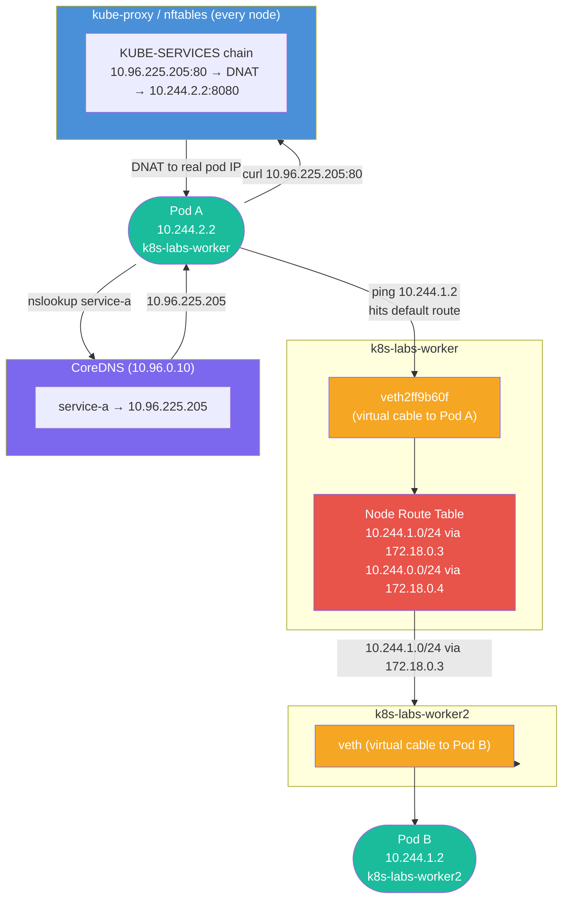

# Hands-On 11 — Networking Internals: No Magic

## What This Lab Is About

You've used Kubernetes networking — Services, DNS, Ingress. This lab tears the abstraction open. You'll see exactly how pods get IPs, how cross-node traffic flows, how a ClusterIP is just a kernel NAT rule, how DNS resolves inside the cluster, and how NetworkPolicy enforces pod-level firewalls.

> "You've used the network. Now you'll understand how it actually works underneath."

---

## Concepts Covered

- **CNI (Container Network Interface)** — how pods get IPs, veth pairs, per-node subnet routing, cross-node communication
- **kube-proxy** — how ClusterIPs are translated to real pod IPs via nftables/iptables rules on every node
- **CoreDNS** — how `service-a.net-lab.svc.cluster.local` resolves, ndots:5 behavior, search domain expansion
- **NetworkPolicy** — L3/L4 pod-level firewall; deny-all, selective ingress/egress (requires Calico/Cilium in production)

---

## Traffic Flow — Cross-Node Pod Communication



---

## File Structure

```
Hands-On-11 — Networking Internals — No Magic/
├── kind-config.yaml             # Multi-node cluster: 1 control-plane + 2 workers
├── namespace.yaml               # net-lab namespace
├── pod-a.yaml                   # netshoot pod pinned to k8s-labs-worker
├── pod-b.yaml                   # netshoot pod pinned to k8s-labs-worker2
├── service-a.yaml               # ClusterIP Service selecting pod-a
├── netpol-deny-all.yaml         # Deny all ingress + egress for all pods in net-lab
├── netpol-allow-a-to-b.yaml     # Allow ingress to pod-b from pod-a only
└── netpol-allow-a-egress.yaml   # Allow egress from pod-a to pod-b only
```

---

## File Explanations

### `kind-config.yaml` — Multi-Node Cluster

Three nodes: 1 control-plane, 2 workers. Two workers are required to observe cross-node CNI routing. No `extraPortMappings` or `ingress-ready` labels needed — this lab has no Ingress.

```yaml
kind: Cluster
apiVersion: kind.x-k8s.io/v1alpha4
nodes:
  - role: control-plane
  - role: worker
  - role: worker
```

---

### `namespace.yaml` — Logical Isolation

All lab resources live in `net-lab`. Keeps observations clean and isolated from system namespaces.

```yaml
apiVersion: v1
kind: Namespace
metadata:
  name: net-lab
```

---

### `pod-a.yaml` / `pod-b.yaml` — Netshoot Pods on Different Nodes

`nicolaka/netshoot` is a network troubleshooting image — ships with `ping`, `nslookup`, `ip`, `curl`, `tcpdump`. `nodeName` pins each pod to a specific worker to force cross-node traffic.

```yaml
apiVersion: v1
kind: Pod
metadata:
  name: pod-a
  namespace: net-lab
  labels:
    app: pod-a
spec:
  nodeName: k8s-labs-worker
  containers:
  - name: pod-a
    image: nicolaka/netshoot
    command: ["sleep", "infinity"]
```

`pod-b.yaml` is identical with `name: pod-b`, `app: pod-b`, `nodeName: k8s-labs-worker2`.

---

### `service-a.yaml` — ClusterIP Service

Exposes `pod-a` internally. The ClusterIP assigned (`10.96.x.x`) exists nowhere as a real interface — it is purely a kube-proxy nftables NAT rule on every node.

```yaml
apiVersion: v1
kind: Service
metadata:
  name: service-a
  namespace: net-lab
spec:
  selector:
    app: pod-a
  ports:
  - port: 80
    targetPort: 8080
  type: ClusterIP
```

---

### `netpol-deny-all.yaml` — Blanket Deny

`podSelector: {}` selects all pods in the namespace. Both `Ingress` and `Egress` policyTypes with no rules = deny everything.

```yaml
apiVersion: networking.k8s.io/v1
kind: NetworkPolicy
metadata:
  name: deny-all
  namespace: net-lab
spec:
  podSelector: {}
  policyTypes:
  - Ingress
  - Egress
```

---

### `netpol-allow-a-to-b.yaml` — Selective Ingress

Allows `pod-b` to receive traffic from `pod-a` only. Does not allow the reverse. Does not fix egress from `pod-a` — that requires a separate policy.

```yaml
apiVersion: networking.k8s.io/v1
kind: NetworkPolicy
metadata:
  name: allow-a-to-b
  namespace: net-lab
spec:
  podSelector:
    matchLabels:
      app: pod-b
  policyTypes:
  - Ingress
  ingress:
  - from:
    - podSelector:
        matchLabels:
          app: pod-a
```

---

### `netpol-allow-a-egress.yaml` — Selective Egress

Allows `pod-a` to send traffic to `pod-b` only. Combined with `allow-a-to-b`, the full path `pod-a → pod-b` is open. `pod-b → pod-a` remains blocked.

```yaml
apiVersion: networking.k8s.io/v1
kind: NetworkPolicy
metadata:
  name: allow-a-egress
  namespace: net-lab
spec:
  podSelector:
    matchLabels:
      app: pod-a
  policyTypes:
  - Egress
  egress:
  - to:
    - podSelector:
        matchLabels:
          app: pod-b
```

---

## Prerequisites

- kind installed (`winget install Kubernetes.kind`)
- kubectl installed
- Docker running

---

## Step-by-Step

### 1. Create Multi-Node Cluster

```bash
kind create cluster --name k8s-labs --config kind-config.yaml
kubectl get nodes
```

Expected: 3 nodes — 1 control-plane, 2 workers — all `Ready`.

---

### 2. Create Namespace

```bash
kubectl apply -f namespace.yaml
kubectl get namespaces
```

---

### 3. Deploy Pods on Different Nodes

```bash
kubectl apply -f pod-a.yaml
kubectl apply -f pod-b.yaml
kubectl get pods -n net-lab -o wide
```

Note the `IP` and `NODE` columns. Pod A and Pod B will have IPs in different `/24` subnets — one subnet per node. This is CNI subnet-per-node allocation.

---

### 4. Prove Cross-Node Communication (CNI)

```bash
# From pod-a, ping pod-b across nodes
kubectl exec -n net-lab pod-a -- ping -c 4 <pod-b-IP>

# From pod-b, ping pod-a
kubectl exec -n net-lab pod-b -- ping -c 4 <pod-a-IP>
```

Both succeed — pods on different nodes communicate directly via pod IP. No NAT. No Service. This is the CNI contract.

---

### 5. Read the Pod Routing Table

```bash
kubectl exec -n net-lab pod-a -- ip route
```

You'll see the pod's default gateway but no route for the other node's subnet. The pod delegates cross-node routing to the node.

---

### 6. Read the Node Routing Table

```bash
kubectl debug node/k8s-labs-worker -it --image=nicolaka/netshoot --profile=sysadmin -- bash
# Inside shell:
ip route
exit
```

You'll see routes like `10.244.1.0/24 via 172.18.0.3` — the node knows how to reach the other node's pod subnet. This is what CNI wrote. The veth entry (`10.244.2.2 dev veth...`) is the virtual cable between the node and pod-a.

---

### 7. Deploy Service + Inspect kube-proxy Rules

```bash
kubectl apply -f service-a.yaml
kubectl get svc -n net-lab
```

Note the `CLUSTER-IP`. Enter the node:

```bash
kubectl debug node/k8s-labs-worker -it --image=nicolaka/netshoot --profile=sysadmin -- bash
# Inside shell:
nft list ruleset | grep -A5 -B5 <CLUSTER-IP>
exit
```

You'll see the `KUBE-SERVICES` chain with a rule matching your ClusterIP. This is the only place that IP exists — a kernel NAT rule, not a real interface.

---

### 8. Prove CoreDNS Resolution

```bash
# See DNS config injected into pod
kubectl exec -n net-lab pod-a -- cat /etc/resolv.conf

# Resolve service name → ClusterIP
kubectl exec -n net-lab pod-a -- nslookup service-a

# Fully qualified resolution
kubectl exec -n net-lab pod-a -- nslookup service-a.net-lab.svc.cluster.local
```

Both return the same ClusterIP. CoreDNS at `10.96.0.10` handles all cluster-internal DNS.

---

### 9. Apply NetworkPolicy — Deny All

```bash
kubectl apply -f netpol-deny-all.yaml

# Confirm traffic is blocked
kubectl exec -n net-lab pod-a -- ping -c 2 <pod-b-IP>
```

100% packet loss. All ingress and egress blocked for all pods in `net-lab`.

> **Note:** NetworkPolicy enforcement requires a CNI that supports it (Calico, Cilium). kind's default CNI (kindnet) does not enforce NetworkPolicy — packets will still be blocked at the policy level but kindnet won't drop them at the network level. In AKS with Calico/Cilium, this works exactly as expected.

---

### 10. Apply Selective Allow

```bash
kubectl apply -f netpol-allow-a-to-b.yaml
kubectl apply -f netpol-allow-a-egress.yaml

# pod-a → pod-b: should work (egress from A + ingress to B both allowed)
kubectl exec -n net-lab pod-a -- ping -c 2 <pod-b-IP>

# pod-b → pod-a: should fail (no egress from B, no ingress to A)
kubectl exec -n net-lab pod-b -- ping -c 2 <pod-a-IP>
```

NetworkPolicy is **both sides** — egress on sender AND ingress on receiver must both be permitted.

---

### 11. Cleanup

```bash
kubectl delete -f netpol-allow-a-egress.yaml
kubectl delete -f netpol-allow-a-to-b.yaml
kubectl delete -f netpol-deny-all.yaml
kubectl delete -f service-a.yaml
kubectl delete -f pod-b.yaml
kubectl delete -f pod-a.yaml
kubectl delete -f namespace.yaml
kind delete cluster --name k8s-labs
```

---

## Key Distinctions

| Concept | What It Is |
|---|---|
| CNI | Assigns pod IPs, creates veth pairs, writes cross-node routes on every node |
| veth pair | Virtual ethernet cable — one end in pod (`eth0`), other end on node |
| ClusterIP | Not a real IP — exists only as a kube-proxy nftables NAT rule |
| KUBE-SERVICES chain | nftables chain where kube-proxy writes Service → Pod IP translation rules |
| CoreDNS | Cluster-internal DNS server — resolves Service names to ClusterIPs |
| ndots:5 | If hostname has <5 dots, try cluster search domains before going external |
| NetworkPolicy | L3/L4 pod firewall — requires CNI support (Calico/Cilium), not kindnet |
| podSelector: {} | Selects all pods in the namespace |

---

## Production Notes

- In AKS, CNI options are Azure CNI (each pod gets a VNet IP) or kubenet (similar to kind's subnet-per-node model)
- NetworkPolicy is enforced by Calico or Cilium in production — kindnet has no enforcement
- kube-proxy can run in `iptables` or `ipvs` mode — newer clusters trend toward nftables backend
- CoreDNS is horizontally scalable — production clusters run 2+ replicas for HA
- `ndots:5` causes extra DNS lookups for external hostnames — can be tuned per pod via `dnsConfig`

---

## Mastery Check

Answer these without reference:

1. What is CNI and what three things does it do when a pod starts?
2. What is a veth pair and where are its two ends?
3. Why does pod-a have no route for pod-b's subnet in its own routing table?
4. What is a ClusterIP and where does it actually exist?
5. What chain does kube-proxy write Service NAT rules into?
6. What is CoreDNS and what IP does it run on in this lab?
7. What does `ndots:5` mean and how does it affect external DNS resolution?
8. What does `podSelector: {}` select in a NetworkPolicy?
9. Why does NetworkPolicy require both egress on the sender AND ingress on the receiver?
10. Why doesn't NetworkPolicy work in kind by default?

---

## What's Next

**Hands-On 12 — Jobs, Cron, and Batch**

Jobs, CronJobs, parallel processing, and the sidecar pattern. You've managed long-running apps — now you'll manage workloads that run, finish, and exit.