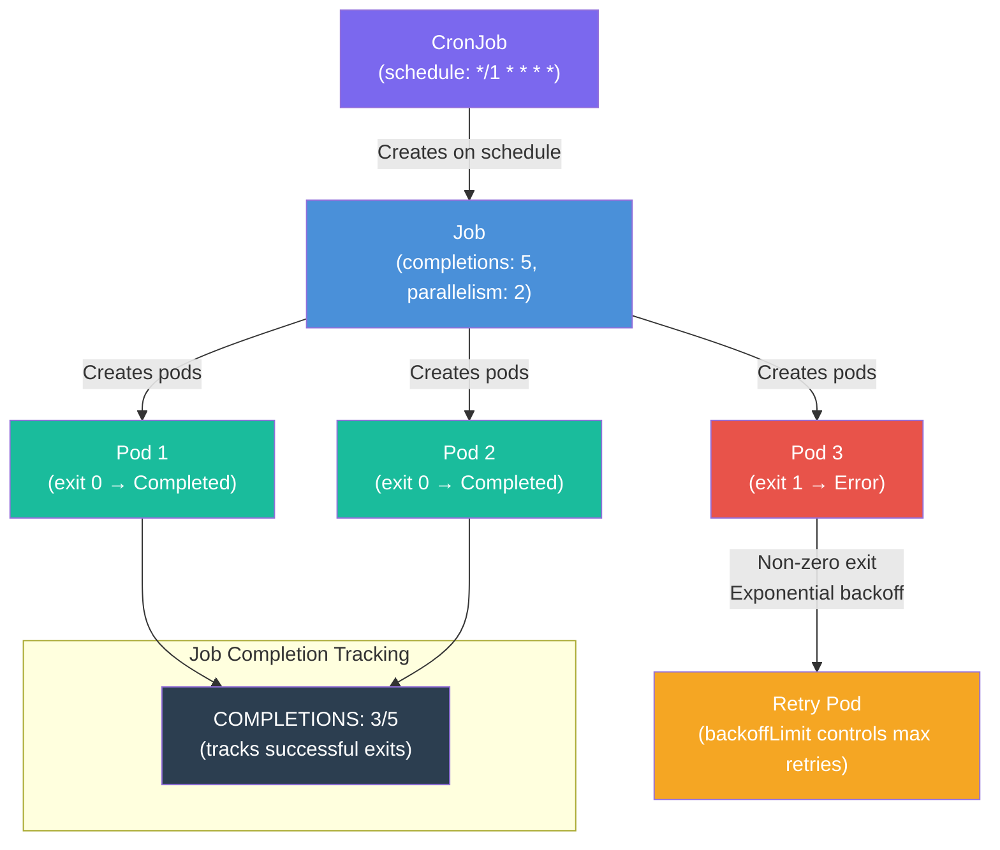

# Hands-On 12 — Jobs, Cron, and Batch

## What This Lab Is About

Every workload you've run so far — Deployments, StatefulSets, DaemonSets — is designed to run forever. Kubernetes restarts them if they die. That's the point.

But some workloads are meant to run, finish, and exit — a database migration, a nightly report, an image processing pipeline, a backup script. For these, Deployments are the wrong tool. A Deployment would restart your completed job as a failure.

Jobs and CronJobs are Kubernetes' answer to batch workloads.

> "You've managed long-running apps. Now you'll manage workloads that run, finish, and exit."

---

## Concepts Covered

- **Job** — run a task to completion. Kubernetes tracks success/failure. Pod exits with code 0 = success. Non-zero = failure.
- **`backoffLimit`** — controlled retries with exponential backoff (10s, 20s, 40s). Prevents infinite pod spawning on failure.
- **`completions` + `parallelism`** — batch processing with concurrency control. N items to process, M workers at a time.
- **`restartPolicy`** — `Never` (new pod per retry, keeps all failed pods for debugging) vs `OnFailure` (same pod restarts in-place, loses previous logs).
- **CronJob** — a Job on a schedule. Manages Job creation, history, and cleanup automatically.
- **`concurrencyPolicy`** — controls overlap: `Allow` (overlap), `Forbid` (skip), `Replace` (kill old, start new).
- **Three-layer chain** — CronJob → Job → Pod. CronJob doesn't run pods directly.

---

## Traffic Flow — Job Lifecycle



---

## File Structure

```
Hands-On-12 — Jobs, Cron, and Batch/
├── kind-config.yaml       # Single-node cluster (no cross-node needed)
├── namespace.yaml         # batch-lab namespace
├── job-basic.yaml         # Simple Job — run once, exit 0, observe completion
├── job-fail.yaml          # Failing Job — exit 1, backoffLimit: 3, observe retries
├── job-parallel.yaml      # Parallel Job — completions: 5, parallelism: 2
└── cronjob.yaml           # CronJob — scheduled every minute with history limits
```

---

## File Explanations

### `kind-config.yaml` — Single-Node Cluster

Single control-plane node. No workers needed — this lab doesn't require cross-node networking. Jobs run wherever the scheduler places them.

```yaml
kind: Cluster
apiVersion: kind.x-k8s.io/v1alpha4
nodes:
  - role: control-plane
```

---

### `namespace.yaml` — Logical Isolation

All lab resources live in `batch-lab`.

```yaml
apiVersion: v1
kind: Namespace
metadata:
  name: batch-lab
```

---

### `job-basic.yaml` — Run Once, Exit, Done

The simplest Job. One container, one command, one successful exit. Proves the fundamental difference between a Job and a Deployment: a Job marks completion on exit 0, a Deployment would restart it.

```yaml
apiVersion: batch/v1
kind: Job
metadata:
  name: hello-job
  namespace: batch-lab
spec:
  template:
    spec:
      containers:
      - name: worker
        image: busybox
        command: ["echo", "Job completed successfully"]
      restartPolicy: Never
```

`restartPolicy: Never` is mandatory for Jobs. `Always` (Deployment default) would restart a completed task forever. Pod stays in `Completed` state after exit — not deleted — so you can still read logs.

---

### `job-fail.yaml` — Failure + Controlled Retries

Forces failure with `exit 1`. `backoffLimit: 3` means 3 retries after the first attempt = 4 pods total. Each retry uses exponential backoff (10s, 20s, 40s). After exhausting retries, Job status = `Failed` with event `BackoffLimitExceeded`.

```yaml
apiVersion: batch/v1
kind: Job
metadata:
  name: fail-job
  namespace: batch-lab
spec:
  backoffLimit: 3
  template:
    spec:
      containers:
      - name: worker
        image: busybox
        command: ["sh", "-c", "echo 'Attempting task...'; exit 1"]
      restartPolicy: Never
```

With `restartPolicy: Never`, each retry creates a **new pod** — all 4 failed pods remain visible for debugging. With `OnFailure`, the same pod restarts in-place (container restart count increments) but previous logs are lost.

---

### `job-parallel.yaml` — Batch Processing with Concurrency

5 items to process (`completions: 5`), 2 workers at a time (`parallelism: 2`). Kubernetes launches pods in batches — never more than 2 simultaneously. When one finishes, the next starts.

```yaml
apiVersion: batch/v1
kind: Job
metadata:
  name: parallel-job
  namespace: batch-lab
spec:
  completions: 5
  parallelism: 2
  template:
    spec:
      containers:
      - name: worker
        image: busybox
        command: ["sh", "-c", "echo Processing item from $(hostname); sleep 5"]
      restartPolicy: Never
```

Each pod gets a unique hostname. No shared state between pods — each runs independently. Job tracks completions: `0/5 → 1/5 → ... → 5/5 → Complete`.

---

### `cronjob.yaml` — Scheduled Job with History Management

Creates a new Job every minute. `successfulJobsHistoryLimit: 3` auto-deletes old completed Jobs. `concurrencyPolicy: Forbid` skips a scheduled run if the previous one is still active.

```yaml
apiVersion: batch/v1
kind: CronJob
metadata:
  name: scheduled-job
  namespace: batch-lab
spec:
  schedule: "*/1 * * * *"
  successfulJobsHistoryLimit: 3
  failedJobsHistoryLimit: 2
  concurrencyPolicy: Forbid
  jobTemplate:
    spec:
      template:
        spec:
          containers:
          - name: worker
            image: busybox
            command: ["sh", "-c", "echo Scheduled run at $(date); sleep 3"]
          restartPolicy: Never
```

Three-layer chain: CronJob creates a Job, Job creates a Pod. Job names are auto-generated with timestamps (e.g., `scheduled-job-29821425`).

---

## Prerequisites

- kind installed (`winget install Kubernetes.kind`)
- kubectl installed
- Docker running

---

## Step-by-Step

### 1. Create Cluster + Namespace

```bash
kind create cluster --name k8s-labs --config kind-config.yaml
kubectl get nodes
kubectl apply -f namespace.yaml
```

Expected: 1 node `Ready`, `batch-lab` namespace created.

---

### 2. Basic Job — Run Once

```bash
kubectl apply -f job-basic.yaml
kubectl get jobs -n batch-lab
kubectl get pods -n batch-lab
kubectl logs -n batch-lab -l job-name=hello-job
```

Expected: `COMPLETIONS: 1/1`, pod in `Completed` status, logs show the echo output. Pod is not restarted — Job is done.

---

### 3. Failing Job — Observe Retries

```bash
kubectl apply -f job-fail.yaml
kubectl get jobs -n batch-lab -w
```

Watch until `Failed`. Then:

```bash
kubectl get pods -n batch-lab -l job-name=fail-job
kubectl describe job fail-job -n batch-lab
```

Expected: 4 pods in `Error` status (1 original + 3 retries). `COMPLETIONS: 0/1`. Events show `BackoffLimitExceeded`. Pods appear with increasing time gaps (exponential backoff).

---

### 4. Parallel Job — Concurrent Execution

```bash
kubectl apply -f job-parallel.yaml
kubectl get jobs -n batch-lab -w
```

Watch `COMPLETIONS` increment: `0/5 → 1/5 → ... → 5/5`. Then:

```bash
kubectl get pods -n batch-lab -l job-name=parallel-job
kubectl logs -n batch-lab -l job-name=parallel-job
```

Expected: 5 pods, all `Completed`. Each has a unique hostname. At no point were more than 2 pods in `Running` state simultaneously.

---

### 5. CronJob — Scheduled Execution

```bash
kubectl apply -f cronjob.yaml
kubectl get cronjobs -n batch-lab
```

Wait 2-3 minutes:

```bash
kubectl get jobs -n batch-lab
kubectl get pods -n batch-lab
```

Expected: New Jobs appearing every minute with auto-generated names. After 3 successful runs, oldest Job is auto-deleted. Each pod's logs show a different timestamp.

---

### 6. Cleanup

```bash
kubectl delete cronjob scheduled-job -n batch-lab
kubectl delete job hello-job fail-job parallel-job -n batch-lab
kubectl delete namespace batch-lab
kind delete cluster --name k8s-labs
```

Delete CronJob first — otherwise it keeps creating new Jobs during cleanup.

---

## Key Distinctions

| Concept | What It Is |
|---|---|
| Job | Runs a task to completion — tracks success/failure, supports retries |
| `backoffLimit` | Max retries before marking Job as Failed. Exponential backoff between retries |
| `completions` | Total number of successful pod exits required |
| `parallelism` | Max pods running simultaneously |
| `restartPolicy: Never` | Each retry = new pod. All failed pods kept for debugging |
| `restartPolicy: OnFailure` | Same pod restarts in-place. Saves resources, loses previous logs |
| CronJob | Creates Jobs on a cron schedule. Three layers: CronJob → Job → Pod |
| `successfulJobsHistoryLimit` | How many completed Jobs to keep. Prevents Job pile-up |
| `concurrencyPolicy` | `Allow` (overlap), `Forbid` (skip), `Replace` (kill old, start new) |
| `SuccessCriteriaMet` → `Complete` | Two-phase Job completion. Intent first, then finalized |
| `FailureTarget` → `Failed` | Two-phase Job failure. Same pattern as completion |

---

## Production Notes

- **Database migrations** — use a Job with `backoffLimit: 1`. If migration fails, you want to investigate, not auto-retry and corrupt data.
- **ETL pipelines** — `completions` + `parallelism` for processing items from a queue. Combine with init containers for dependency setup.
- **CronJob timezone** — `spec.timeZone` field (e.g., `"Europe/Amsterdam"`) available since K8s 1.27. Without it, schedule follows the kube-controller-manager's timezone.
- **CronJob missed schedules** — if the controller is down for >100 missed schedules, the CronJob stops scheduling entirely. `startingDeadlineSeconds` controls this threshold.
- **Job TTL cleanup** — `spec.ttlSecondsAfterFinished` auto-deletes completed/failed Jobs after a duration. Alternative to manual cleanup.
- **Indexed Jobs** — `completionMode: Indexed` assigns each pod an index (`JOB_COMPLETION_INDEX` env var). Useful for processing specific partitions of data.

---

## Mastery Check

Answer these without reference:

1. What is the difference between a Job and a Deployment in terms of restart behavior?
2. Why is `restartPolicy: Always` not allowed for Jobs?
3. What does `backoffLimit: 3` mean and how many total pods does it create?
4. What is exponential backoff and why does Kubernetes use it for Job retries?
5. What is the difference between `restartPolicy: Never` and `OnFailure` for Jobs?
6. What do `completions` and `parallelism` control?
7. What is a CronJob and what three-layer chain does it create?
8. What does `concurrencyPolicy: Forbid` do?
9. What does `successfulJobsHistoryLimit` prevent?
10. What are the two-phase status transitions for Job completion and failure?

---

## What's Next

**Hands-On 13 — Helm — Package Your Platform**

Helm Charts, Templating, Multi-env Deployments, and Rollback. You've deployed raw YAML — now you'll package, version, and manage it like a platform engineer.