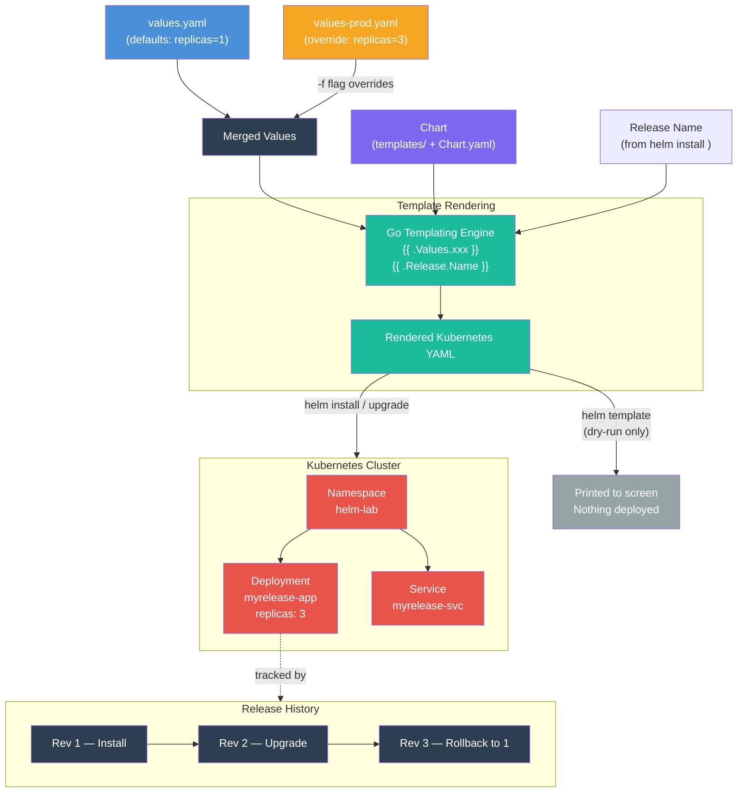

# Hands-On 13 — Helm: Package Your Platform

## What This Lab Is About

Every lab so far, you've written raw YAML — one file per resource, one `kubectl apply` per file. That works for learning. It doesn't work for managing 15 microservices across dev/staging/prod where the only differences are image tags, replica counts, and resource limits.

Helm is a **package manager for Kubernetes** — same concept as apt/yum for Linux or npm for Node. One chart, multiple environments, built-in rollback.

> "You've deployed raw YAML. Now you'll package, version, and manage it like a platform engineer."

---

## Concepts Covered

- **Chart** — a folder structure that packages all your YAML templates into one deployable unit
- **Templating** — Go template syntax (`{{ .Values.xxx }}`) to inject values into YAML at render time
- **`values.yaml`** — default configuration. Override with `-f values-prod.yaml` per environment
- **`{{ .Release.Name }}`** — injected from the `helm install <name>` command, makes resource names unique per release
- **Release management** — Helm tracks revisions. `helm upgrade` increments revision, `helm rollback` creates a new revision with old config
- **`helm template`** — dry-run rendering (like `terraform plan`). Prints YAML without deploying
- **`helm install`** — renders and deploys to cluster (like `terraform apply`)

---

## Helm Workflow — From Chart to Cluster



---

## Chart Structure

```
myapp/
├── Chart.yaml          # Required — chart name, version, metadata (MUST be .yaml, not .yml)
├── values.yaml         # Required — default values (MUST be .yaml, not .yml)
├── values-prod.yaml    # Optional — environment override
└── templates/          # Required — Kubernetes manifests with Go templating
    ├── namespace.yaml
    ├── deployment.yaml
    └── service.yaml
```

### Production Additions

```
myapp/
├── Chart.yaml
├── values.yaml
├── templates/
│   ├── deployment.yaml
│   ├── service.yaml
│   ├── ingress.yaml
│   ├── configmap.yaml
│   ├── hpa.yaml
│   ├── _helpers.tpl        # Reusable template snippets (labels, names)
│   └── NOTES.txt           # Post-install message shown to user
└── charts/                  # Sub-charts (dependencies)

environments/                # Separate from chart in GitOps setups
├── dev/values.yaml
├── staging/values.yaml
└── prod/values.yaml
```

---

## Values Flow

```
values-prod.yaml (override via -f flag)
       ↓
  merges with
       ↓
values.yaml (defaults)
       ↓
  injected into
       ↓
templates/*.yaml (blueprints)
       ↓
  rendered into
       ↓
raw Kubernetes YAML
       ↓
  applied to
       ↓
cluster (resources created)
```

Override files only need to specify keys they change. Everything else falls back to `values.yaml` defaults. Same as Terraform `.tfvars` overriding `variables.tf`.

---

## File Explanations

### `Chart.yaml` — Chart Metadata

Helm reads this first. Without it, the folder is not recognized as a chart. **Must be named `Chart.yaml`** — not `chart.yaml`, not `Chart.yml`. Case-sensitive, extension-sensitive.

```yaml
apiVersion: v2
name: myapp
description: A demo Helm chart for Hands-On 13
version: 1.0.0
appVersion: "1.0"
```

---

### `values.yaml` — Default Configuration

The single source of configurable values. Templates reference these via `{{ .Values.xxx }}`. **Must be named `values.yaml`** — not `values.yml`.

```yaml
namespace: helm-lab

replicaCount: 1

image:
  repository: nginx
  tag: "1.27"

service:
  type: ClusterIP
  port: 80
```

---

### `values-prod.yaml` — Environment Override

Passed via `-f` flag. Overrides only the keys it specifies. Can live inside the chart folder or anywhere on disk — the `-f` flag takes any file path.

```yaml
namespace: helm-lab

replicaCount: 3

image:
  repository: nginx
  tag: "1.27"

service:
  type: ClusterIP
  port: 80
```

---

### `templates/namespace.yaml` — Templated Namespace

```yaml
apiVersion: v1
kind: Namespace
metadata:
  name: {{ .Values.namespace }}
```

`{{ .Values.namespace }}` pulls from `values.yaml` → renders as `helm-lab`.

---

### `templates/deployment.yaml` — Templated Deployment

```yaml
apiVersion: apps/v1
kind: Deployment
metadata:
  name: {{ .Release.Name }}-app
  namespace: {{ .Values.namespace }}
spec:
  replicas: {{ .Values.replicaCount }}
  selector:
    matchLabels:
      app: {{ .Release.Name }}
  template:
    metadata:
      labels:
        app: {{ .Release.Name }}
    spec:
      containers:
      - name: app
        image: {{ .Values.image.repository }}:{{ .Values.image.tag }}
        ports:
        - containerPort: 80
```

`{{ .Release.Name }}` comes from the `helm install <name>` command — not from any file. Makes resource names unique per release.

---

### `templates/service.yaml` — Templated Service

```yaml
apiVersion: v1
kind: Service
metadata:
  name: {{ .Release.Name }}-svc
  namespace: {{ .Values.namespace }}
spec:
  selector:
    app: {{ .Release.Name }}
  ports:
  - port: {{ .Values.service.port }}
    targetPort: 80
  type: {{ .Values.service.type }}
```

---

## Prerequisites

- kind installed (`winget install Kubernetes.kind`)
- kubectl installed
- Helm installed (`winget install Helm.Helm`)
- Docker running

---

## Step-by-Step

### 1. Create Cluster + Verify Helm

```bash
kind create cluster --name k8s-labs --config kind-config.yaml
kubectl get nodes
helm version
```

Expected: 1 node `Ready`, Helm version output.

---

### 2. Create Chart From Scratch

Create the `myapp/` folder structure manually. Do NOT use `helm create` — it generates bloated boilerplate.

```
myapp/
├── Chart.yaml
├── values.yaml
└── templates/
    ├── namespace.yaml
    ├── deployment.yaml
    └── service.yaml
```

Verify templates render correctly:

```bash
helm template myrelease ./myapp
```

Expected: rendered YAML with `namespace: helm-lab`, `replicas: 1`, `image: nginx:1.27`, all resource names prefixed with `myrelease`.

> **Note:** If using VS Code, disable "Format on Save" for template files — formatters may insert spaces in `{{ }}` braces, breaking Go template syntax.

---

### 3. Deploy with Helm

```bash
helm install myrelease ./myapp
kubectl get all -n helm-lab
helm list -A
```

Expected: Deployment, Service, Pod created in `helm-lab`. `helm list` shows `myrelease` at `REVISION: 1`.

Note: Helm stores release metadata in the namespace specified on the command (defaults to `default`). Resources are created wherever the templates specify — `helm-lab` in this case.

---

### 4. Multi-Environment Values

Create `values-prod.yaml` with `replicaCount: 3`. Compare rendered output:

```bash
helm template dev ./myapp
helm template prod ./myapp -f values-prod.yaml
```

Expected: `dev` renders `replicas: 1`, `name: dev-app`. `prod` renders `replicas: 3`, `name: prod-app`. Same chart, different results.

---

### 5. Upgrade + Rollback

Upgrade to prod values:

```bash
helm upgrade myrelease ./myapp -f values-prod.yaml
kubectl get pods -n helm-lab
helm list -A
```

Expected: 3 pods, `REVISION: 2`.

Rollback to revision 1:

```bash
helm rollback myrelease 1
kubectl get pods -n helm-lab
helm history myrelease
```

Expected: Back to 1 pod. `REVISION: 3` (rollback creates a new revision, not rewind). `helm history` shows full timeline with `Description: Rollback to 1`.

---

### 6. Cleanup

```bash
helm uninstall myrelease
kubectl delete namespace helm-lab
kind delete cluster --name k8s-labs
```

`helm uninstall` deletes all chart-managed resources except the namespace — Helm is cautious about namespace deletion since other resources might live there.

---

## Key Distinctions

| Concept | What It Is |
|---|---|
| Chart | Folder with `Chart.yaml` + `values.yaml` + `templates/` — a packaged Kubernetes application |
| `Chart.yaml` | Chart metadata — name, version. Must be exactly `Chart.yaml` (case + extension sensitive) |
| `values.yaml` | Default configuration. Must be exactly `values.yaml`. Templates pull from here via `{{ .Values.xxx }}` |
| `{{ .Values.xxx }}` | Go template syntax — injects values from `values.yaml` or override file |
| `{{ .Release.Name }}` | Injected from `helm install <name>` command. Makes resource names unique per release |
| `-f values-prod.yaml` | Override file — merges with defaults. Only overridden keys change |
| `helm template` | Dry-run — renders YAML locally without deploying. Like `terraform plan` |
| `helm install` | Renders and deploys to cluster. Creates revision 1. Like `terraform apply` |
| `helm upgrade` | Updates an existing release with new values/chart. Increments revision |
| `helm rollback` | Creates a new revision with a previous revision's config. Does not rewind history |
| `helm uninstall` | Deletes all chart-managed resources. Does not delete namespaces |
| `helm history` | Shows full revision timeline — installs, upgrades, rollbacks with timestamps |
| Revision | Incremental version number. Every install/upgrade/rollback increments it |

---

## Production Notes

- **`_helpers.tpl`** — define reusable template functions for labels, names, selectors. Avoids copy-paste across templates.
- **`NOTES.txt`** — post-install instructions printed to terminal. Common for DB connection strings, URLs.
- **`charts/` directory** — sub-charts for dependencies (e.g., your app depends on Redis). Managed via `Chart.yaml` `dependencies` section.
- **Helm repositories** — `helm repo add` to pull public charts (Prometheus, Grafana, nginx-ingress). Your own charts can be hosted in OCI registries (ACR, ECR).
- **`helm diff`** plugin — shows a diff between current release and pending upgrade. Essential for production change review.
- **ArgoCD + Helm** — ArgoCD can deploy Helm charts directly. It renders templates and applies them, tracking drift against Git. This is Hands-On 15.
- **Namespace strategy** — in production, each environment typically gets its own namespace (`dev`, `staging`, `prod`) rather than sharing one. Override `namespace` in values per environment.

---

## Mastery Check

Answer these without reference:

1. What three files/folders are required in a Helm chart?
2. Why must the metadata file be named `Chart.yaml` and not `Chart.yml` or `chart.yaml`?
3. What is `{{ .Values.replicaCount }}` and where does it pull its value from?
4. What is `{{ .Release.Name }}` and where does it come from?
5. What does `helm template` do vs `helm install`?
6. What does the `-f` flag do and can the override file be outside the chart folder?
7. What happens to revision numbers during upgrade and rollback?
8. Why does rollback create revision 3 instead of reverting to revision 1?
9. What does `helm uninstall` NOT delete?
10. How does `helm history` help in production incident response?

---

## What's Next

**Hands-On 14 — Observe Everything**

Prometheus, Grafana, ServiceMonitor, PromQL, and Alerting. You've deployed and managed apps — now you'll observe them. No observability = flying blind in production.