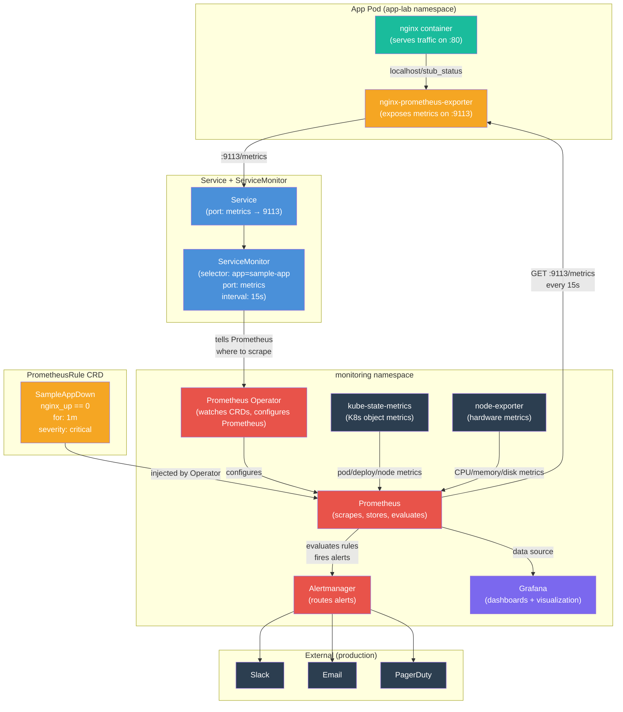
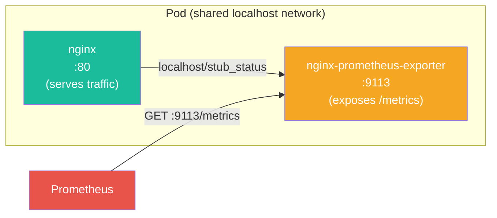

# Hands-On 14 — Observe Everything

## What This Lab Is About

You've deployed apps, scaled them, secured them, packaged them with Helm. But right now, if something breaks in your cluster — a pod eating 100% CPU, a service returning 500s, a node running out of memory — you'd only know when someone complains.

Observability fixes that. Prometheus collects metrics. Grafana visualizes them. Alerting notifies you before users do.

> "You can't fix what you can't see. You can't prevent what you can't measure."

---

## Concepts Covered

- **Prometheus** — pull-based metrics collector. Scrapes HTTP endpoints on a schedule, stores time-series data, evaluates alert rules, serves PromQL queries
- **Grafana** — visualization UI. Connects to Prometheus as a data source, renders dashboards. No storage, no logic — pure display layer
- **Alertmanager** — alert router. Receives fired alerts from Prometheus, deduplicates, groups, and routes them to Slack/email/PagerDuty
- **ServiceMonitor** — CRD that tells Prometheus "this Service exists, scrape this port at this interval." Without it, Prometheus doesn't know your app exists
- **PrometheusRule** — CRD that defines alert rules as PromQL expressions. The Prometheus Operator injects these into Prometheus config automatically
- **Prometheus Operator** — watches ServiceMonitor and PrometheusRule CRDs, configures Prometheus without manual config file edits
- **kube-state-metrics** — exposes Kubernetes object-level metrics (pod status, deployment replicas, node conditions)
- **node-exporter** — exposes node-level hardware metrics (CPU, memory, disk, network) as a DaemonSet
- **PromQL** — Prometheus Query Language. Used in dashboards, alerts, and ad-hoc queries
- **Sidecar Pattern** — two containers in one pod: app serves traffic, exporter exposes metrics. Shared localhost network

---

## Architecture — End-to-End Observability Chain



---

## How Scraping Works — Pull vs Push

Prometheus is **pull-based**. It does not wait for your app to send data. Every `interval` (15s in this lab), Prometheus makes an HTTP GET request:

```
GET http://10.244.0.13:9113/metrics
```

The response is plain text in Prometheus exposition format:

```
# HELP nginx_up Status of the last metric scrape
# TYPE nginx_up gauge
nginx_up 0
# HELP process_resident_memory_bytes Resident memory size in bytes
# TYPE process_resident_memory_bytes gauge
process_resident_memory_bytes 17268736
```

Each line is a metric with a name, optional labels, and a value. Prometheus parses this, timestamps it, and stores it. Every 15 seconds, a new data point is added to each metric's time series.

**Why pull, not push?**
- Prometheus controls the schedule — no thundering herd of apps pushing simultaneously
- If an app dies, Prometheus detects it immediately (scrape fails → `up == 0`)
- No client-side buffering or retry logic needed in your app
- Service discovery (via ServiceMonitor) handles dynamic pod IPs automatically

---

## Component Roles — What Does What

| Component | What It Does | Analogy |
|---|---|---|
| **Prometheus** | Scrapes metrics endpoints, stores time-series, evaluates alert rules, serves PromQL queries | Security camera system — records everything, triggers alarms |
| **Grafana** | Connects to Prometheus, runs PromQL queries, renders graphs/dashboards. No storage, no logic | Monitor screens — displays what cameras recorded |
| **Alertmanager** | Receives fired alerts from Prometheus, deduplicates, groups, routes to notification channels | The guard who calls police when an alarm triggers |
| **ServiceMonitor** | CRD telling Prometheus which Service to scrape, which port, at what interval | Plugging a new camera into the system |
| **PrometheusRule** | CRD defining alert rules as PromQL expressions with severity and annotations | Setting the alarm trigger threshold |
| **Prometheus Operator** | Watches ServiceMonitor/PrometheusRule CRDs, auto-configures Prometheus | The technician who wires new cameras and alarms into the system |
| **kube-state-metrics** | Exposes K8s object metrics — pod phase, deployment replicas, node conditions | Building management system reporting room occupancy |
| **node-exporter** | DaemonSet exposing node hardware metrics — CPU, memory, disk, network | Hardware sensors on each floor |

Grafana without Prometheus = screens with no cameras.
Prometheus without Grafana = cameras recording but nobody watching.

---

## The Sidecar Pattern — Two Containers, One Pod



Both containers share the same network namespace — they communicate via `localhost`. The exporter scrapes nginx's internal status and re-exposes it in Prometheus format. Your app code doesn't need to know anything about Prometheus.

This is the sidecar pattern from Hands-On 12 (Jobs lab) in action — one container does work, another handles a cross-cutting concern (observability).

---

## File Structure

```
Hands-On-14 — Observe Everything/
├── kind-config.yaml          # Single-node cluster with port mappings for Grafana (30080) and Prometheus (30090)
├── namespace.yaml            # app-lab namespace for sample application
├── deployment.yaml           # nginx + prometheus-exporter sidecar (2 containers per pod)
├── service.yaml              # ClusterIP exposing port 80 (http) and 9113 (metrics)
├── servicemonitor.yaml       # Tells Prometheus to scrape the metrics port every 15s
└── alert-rule.yaml           # PrometheusRule — fires when nginx_up == 0 for 1 minute
```

The monitoring stack itself (Prometheus, Grafana, Alertmanager, node-exporter, kube-state-metrics, Prometheus Operator) is installed via the `kube-prometheus-stack` Helm chart — no manual YAML needed for those components.

---

## File Explanations

### `kind-config.yaml` — Cluster with Port Mappings

Two port mappings expose Grafana and Prometheus UIs to your browser. Without these, the NodePort Services would be unreachable from outside the Docker network.

```yaml
kind: Cluster
apiVersion: kind.x-k8s.io/v1alpha4
nodes:
  - role: control-plane
    extraPortMappings:
    - containerPort: 30080
      hostPort: 30080
    - containerPort: 30090
      hostPort: 30090
```

---

### `namespace.yaml` — App Isolation

```yaml
apiVersion: v1
kind: Namespace
metadata:
  name: app-lab
```

---

### `deployment.yaml` — App + Exporter Sidecar

Two containers in one pod. nginx serves traffic, the exporter scrapes nginx's `/stub_status` and re-exposes metrics in Prometheus format on port 9113.

```yaml
apiVersion: apps/v1
kind: Deployment
metadata:
  name: sample-app
  namespace: app-lab
spec:
  replicas: 2
  selector:
    matchLabels:
      app: sample-app
  template:
    metadata:
      labels:
        app: sample-app
    spec:
      containers:
      - name: app
        image: nginx
        ports:
        - containerPort: 80
      - name: exporter
        image: nginx/nginx-prometheus-exporter
        args: ["-nginx.scrape-uri=http://localhost/stub_status"]
        ports:
        - containerPort: 9113
          name: metrics
```

The `name: metrics` on the container port is a convention — ServiceMonitor references this name to know which port to tell Prometheus to scrape.

---

### `service.yaml` — Exposing Both Ports

Two named ports: `http` for app traffic, `metrics` for Prometheus scraping. The `app: sample-app` label on the Service is what ServiceMonitor's `selector` matches against.

```yaml
apiVersion: v1
kind: Service
metadata:
  name: sample-app
  namespace: app-lab
  labels:
    app: sample-app
spec:
  selector:
    app: sample-app
  ports:
  - name: http
    port: 80
    targetPort: 80
  - name: metrics
    port: 9113
    targetPort: 9113
```

---

### `servicemonitor.yaml` — Wiring App to Prometheus

This is the critical piece. Without it, Prometheus doesn't know your app exists. The Prometheus Operator watches for ServiceMonitor CRDs and automatically configures Prometheus to scrape the matching Service.

```yaml
apiVersion: monitoring.coreos.com/v1
kind: ServiceMonitor
metadata:
  name: sample-app-monitor
  namespace: app-lab
spec:
  selector:
    matchLabels:
      app: sample-app
  endpoints:
  - port: metrics
    interval: 15s
```

- **`selector.matchLabels`** — finds the Service with label `app: sample-app`
- **`port: metrics`** — scrape the port named `metrics` (9113)
- **`interval: 15s`** — Prometheus hits `/metrics` every 15 seconds

**Connection chain:** ServiceMonitor → finds Service by label → Service has endpoints (pod IPs) → Prometheus scrapes each pod's `:9113/metrics`

---

### `alert-rule.yaml` — PrometheusRule

Defines an alert that fires when `nginx_up == 0` for more than 1 minute. The Prometheus Operator injects this rule into Prometheus's config automatically.

```yaml
apiVersion: monitoring.coreos.com/v1
kind: PrometheusRule
metadata:
  name: sample-app-alerts
  namespace: app-lab
  labels:
    release: kube-prom
spec:
  groups:
  - name: sample-app
    rules:
    - alert: SampleAppDown
      expr: nginx_up{namespace="app-lab"} == 0
      for: 1m
      labels:
        severity: critical
      annotations:
        summary: "Nginx exporter cannot reach nginx stub_status"
        description: "Pod {{ $labels.pod }} has nginx_up=0 for more than 1 minute"
```

- **`expr`** — PromQL expression evaluated on every scrape cycle
- **`for: 1m`** — condition must be true for 1 minute before firing. Prevents alert flapping on transient issues
- **`labels.severity: critical`** — Alertmanager uses this to route to the right channel (critical → PagerDuty, warning → Slack)
- **`annotations`** — human-readable context included in the notification. `{{ $labels.pod }}` is Go templating that inserts the pod name

**Alert lifecycle:** `INACTIVE` → `PENDING` (condition true, waiting for `for` duration) → `FIRING` (condition true for full duration, alert sent to Alertmanager) → `INACTIVE` (condition resolved)

---

## Prerequisites

- kind installed (`winget install Kubernetes.kind`)
- kubectl installed
- Helm installed (`winget install Helm.Helm`)
- Docker running

---

## Step-by-Step

### 1. Create Cluster with Port Mappings

```bash
kind create cluster --name k8s-labs --config kind-config.yaml
kubectl get nodes
```

Expected: 1 node `Ready`.

---

### 2. Install kube-prometheus-stack via Helm

```bash
helm repo add prometheus-community https://prometheus-community.github.io/helm-charts
helm repo update
kubectl create namespace monitoring
```

Install with namespace selectors enabled for cross-namespace ServiceMonitor and PrometheusRule discovery:

```bash
helm install kube-prom prometheus-community/kube-prometheus-stack --namespace monitoring --set grafana.service.type=NodePort --set grafana.service.nodePort=30080 --set prometheus.prometheusSpec.serviceMonitorSelectorNilUsesHelmValues=false --set prometheus.prometheusSpec.serviceMonitorNamespaceSelector.any=true --set prometheus.prometheusSpec.ruleNamespaceSelector.any=true --set prometheus.prometheusSpec.ruleSelectorNilUsesHelmValues=false --set prometheus.service.type=NodePort --set prometheus.service.nodePort=30090
```

Key flags explained:

| Flag | What It Does |
|---|---|
| `grafana.service.type=NodePort` | Exposes Grafana on port 30080 |
| `prometheus.service.type=NodePort` | Exposes Prometheus on port 30090 |
| `serviceMonitorSelectorNilUsesHelmValues=false` | Prometheus picks up ANY ServiceMonitor, not just ones with Helm labels |
| `serviceMonitorNamespaceSelector.any=true` | Watch ServiceMonitors in ALL namespaces, not just `monitoring` |
| `ruleNamespaceSelector.any=true` | Watch PrometheusRules in ALL namespaces |
| `ruleSelectorNilUsesHelmValues=false` | Pick up ANY PrometheusRule regardless of labels |

Wait for all pods:

```bash
kubectl get pods -n monitoring -w
```

Expected: 6 pods all `Running` (Prometheus, Grafana, Alertmanager, Operator, kube-state-metrics, node-exporter). Image pulls may take 3-5 minutes on first run.

**What got deployed:**

| Pod | Role |
|---|---|
| `prometheus-...-prometheus-0` | Scrapes and stores metrics (2 containers: prometheus + config-reloader) |
| `kube-prom-grafana-...` | Dashboard UI (3 containers: grafana + 2 sidecars for auto-loading dashboards/datasources) |
| `alertmanager-...-alertmanager-0` | Routes alerts to notification channels |
| `kube-prom-kube-prometheus-operator-...` | Watches ServiceMonitor/PrometheusRule CRDs, configures Prometheus |
| `kube-prom-kube-state-metrics-...` | Exposes K8s object metrics (pod status, replicas, etc.) |
| `kube-prom-prometheus-node-exporter-...` | Exposes node hardware metrics (CPU, memory, disk) |

---

### 3. Access Grafana

Open `http://localhost:30080`. Get the admin password:

```bash
kubectl get secret kube-prom-grafana -n monitoring -o jsonpath="{.data.admin-password}"
```

Decode the base64 output (PowerShell):

```bash
[System.Text.Encoding]::UTF8.GetString([System.Convert]::FromBase64String("<base64-string>"))
```

Login with `admin` / `<decoded-password>`. If password fails, reset it:

```bash
kubectl exec -n monitoring <grafana-pod-name> -c grafana -- grafana cli admin reset-admin-password admin123
```

If locked out from too many attempts, delete the pod (ReplicaSet recreates it with a clean lockout counter):

```bash
kubectl delete pod <grafana-pod-name> -n monitoring
```

Navigate to **Dashboards → Kubernetes / Compute Resources / Cluster** to see live CPU, memory, and network graphs — all pre-wired from the Helm chart.

---

### 4. Deploy App with Metrics Endpoint

```bash
kubectl apply -f namespace.yaml
kubectl apply -f deployment.yaml
kubectl apply -f service.yaml
kubectl get pods -n app-lab
```

Expected: 2 pods, each `2/2 Running` (nginx + exporter). Verify metrics are exposed:

```bash
kubectl exec -n app-lab deploy/sample-app -c app -- curl -s http://localhost:9113/metrics
```

Expected: Prometheus-format metrics (lines like `nginx_up 0`, `process_resident_memory_bytes 17268736`).

---

### 5. Create ServiceMonitor

```bash
kubectl apply -f servicemonitor.yaml
kubectl get servicemonitor -n app-lab
```

Verify in Prometheus UI: open `http://localhost:30090` → **Status → Targets** → search `app-lab`. You should see `serviceMonitor/app-lab/sample-app-monitor/0` with 2 endpoints, both `UP`.

---

### 6. Query with PromQL

Open `http://localhost:30090` → **Query** tab. Execute these:

**Check your app's metrics exist:**
```promql
nginx_exporter_build_info{namespace="app-lab"}
```

**Memory usage per exporter pod:**
```promql
process_resident_memory_bytes{namespace="app-lab"}
```

**Rate of scrape requests (per-second over 1 minute):**
```promql
rate(promhttp_metric_handler_requests_total{namespace="app-lab"}[1m])
```

**CPU usage per namespace (cluster-wide):**
```promql
sum by (namespace) (rate(container_cpu_usage_seconds_total{namespace!=""}[5m]))
```

Key PromQL concepts demonstrated:
- **Label filtering** — `{namespace="app-lab"}` narrows results to your namespace
- **`rate()`** — calculates per-second rate of change for counters over a time window
- **`sum by (namespace)`** — aggregates across all pods, grouped by namespace
- **`[5m]`** — range vector selector: use the last 5 minutes of data points for the calculation

---

### 7. Create Alert Rule

```bash
kubectl apply -f alert-rule.yaml
```

Check Prometheus UI → **Alerts** tab → search `sample`. Alert lifecycle:
- **INACTIVE** → condition not yet evaluated
- **UNKNOWN** → first evaluation pending
- **PENDING** → condition true, waiting for `for: 1m` duration
- **FIRING** → condition true for full duration, alert sent to Alertmanager

In this lab, `nginx_up == 0` is always true (stub_status not enabled), so the alert fires with `FIRING (2)` — one per pod.

---

### 8. Cleanup

```bash
kubectl delete -f alert-rule.yaml
kubectl delete -f servicemonitor.yaml
kubectl delete -f service.yaml
kubectl delete -f deployment.yaml
kubectl delete -f namespace.yaml
helm uninstall kube-prom -n monitoring
kubectl delete namespace monitoring
kind delete cluster --name k8s-labs
```

---

## Key Distinctions

| Concept | What It Is |
|---|---|
| Scrape | Prometheus pulling metrics via HTTP GET to `/metrics` on a schedule. Pull-based, not push-based |
| ServiceMonitor | CRD wiring a Service's metrics port to Prometheus. Without it, Prometheus doesn't know your app exists |
| PrometheusRule | CRD defining alert rules as PromQL. Operator injects into Prometheus config automatically |
| Prometheus Operator | Controller watching CRDs (ServiceMonitor, PrometheusRule), auto-configures Prometheus |
| kube-state-metrics | Exposes K8s object metrics (pod phase, deployment replicas). Not hardware — Kubernetes state |
| node-exporter | DaemonSet exposing node hardware metrics (CPU, memory, disk, network) |
| PromQL | Query language for Prometheus. Used in dashboards, alerts, and ad-hoc queries |
| `rate()` | PromQL function calculating per-second rate of change for counter metrics over a time window |
| `sum by (label)` | PromQL aggregation — sums values grouped by a label |
| `for: 1m` | Alert must be true for this duration before firing. Prevents flapping |
| Alert lifecycle | INACTIVE → PENDING → FIRING → INACTIVE (resolved) |
| Sidecar pattern | Two containers in one pod sharing localhost. App + exporter is the canonical observability sidecar |
| `serviceMonitorNamespaceSelector.any=true` | Prometheus watches ServiceMonitors in all namespaces, not just its own |
| NodePort | Service type exposing on a static port (30000-32767) on every node. Used here to access UIs from browser |

---

## Production Notes

- **Persistent storage** — production Prometheus uses PVCs backed by cloud disks (Azure Managed Disk, AWS EBS) so metrics survive pod restarts. Without it, restarting Prometheus loses all historical data.
- **Retention** — default Prometheus retention is 15 days. For long-term storage, use Thanos or Cortex as a remote write backend.
- **Grafana dashboards as code** — production dashboards are stored as ConfigMaps or in Git, auto-loaded via sidecar. Never create dashboards manually in the UI — they'll be lost on pod restart.
- **Alertmanager routing** — production setups route by severity: `critical` → PagerDuty (pages on-call engineer), `warning` → Slack channel, `info` → dashboard only.
- **High availability** — Prometheus Operator supports running 2 Prometheus replicas with deduplication. Alertmanager runs in a cluster (gossip protocol) for HA.
- **Federation** — large-scale setups use Prometheus federation: one global Prometheus scrapes aggregated metrics from per-cluster Prometheus instances.
- **Recording rules** — pre-compute expensive PromQL queries and store results as new metrics. Reduces dashboard load time for complex queries.
- **ServiceMonitor vs PodMonitor** — ServiceMonitor targets Services (most common). PodMonitor targets pods directly — useful when you don't have a Service in front of the pod.
- **In AKS** — Azure Monitor for containers provides managed Prometheus + Grafana (Azure Managed Grafana). Alternatively, deploy kube-prometheus-stack the same way you did here.
- **Namespace selectors matter** — by default, Prometheus only watches its own namespace for ServiceMonitors and PrometheusRules. Always configure `serviceMonitorNamespaceSelector.any=true` and `ruleNamespaceSelector.any=true` if your apps live in other namespaces.

---

## Mastery Check

Answer these without reference:

1. What is Prometheus and how does it collect metrics (pull vs push)?
2. What is the role of Grafana in the monitoring stack?
3. What is a ServiceMonitor and why is it needed?
4. What is the difference between kube-state-metrics and node-exporter?
5. What is the Prometheus Operator and what CRDs does it watch?
6. What does `serviceMonitorNamespaceSelector.any=true` do and why is it needed?
7. What is PromQL and what does `rate(metric[1m])` calculate?
8. What is the sidecar pattern and how is it used for observability?
9. What is a PrometheusRule and what does `for: 1m` mean?
10. What is the alert lifecycle (4 states)?
11. Why does Prometheus use pull-based scraping instead of push?
12. What happens to all metrics data when you delete the kind cluster and how is this solved in production?

---

## What's Next

**Hands-On 15 — GitOps: The Cluster Manages Itself**

ArgoCD, Drift Detection, Auto-sync, and App of Apps. You've deployed manually with `kubectl` and `helm install`. Now the cluster will deploy itself from Git — the CI/CD pipeline pushes to Git, ArgoCD syncs the cluster. No more `kubectl apply` in production.