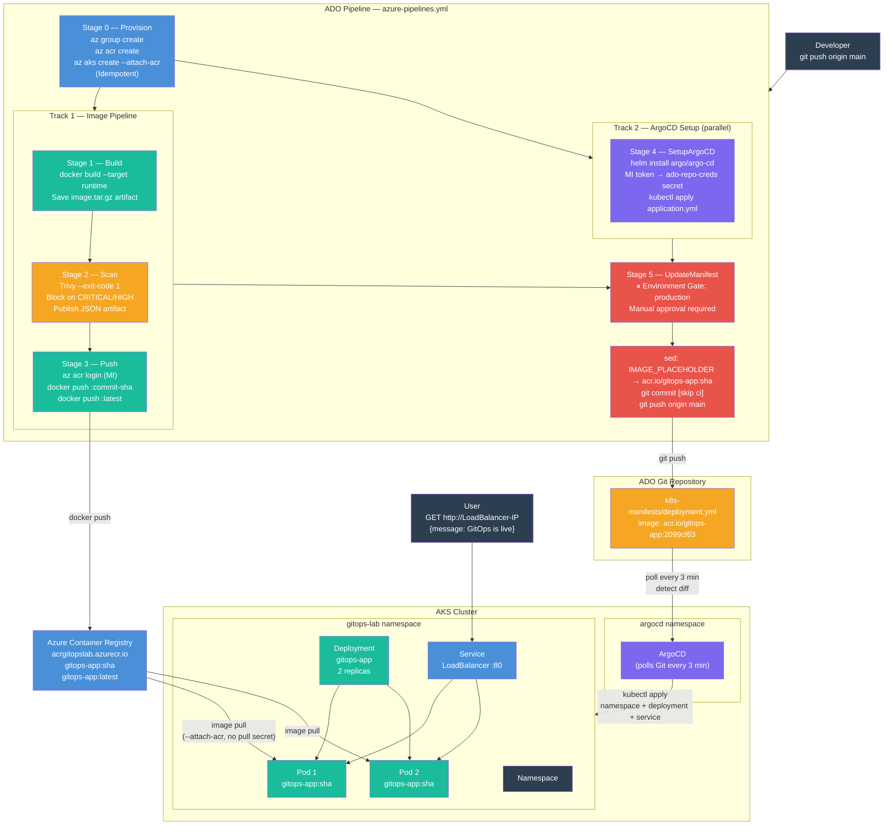
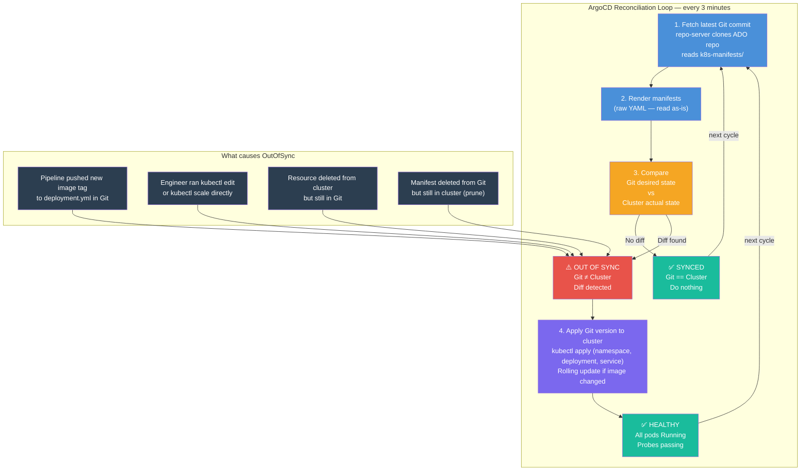
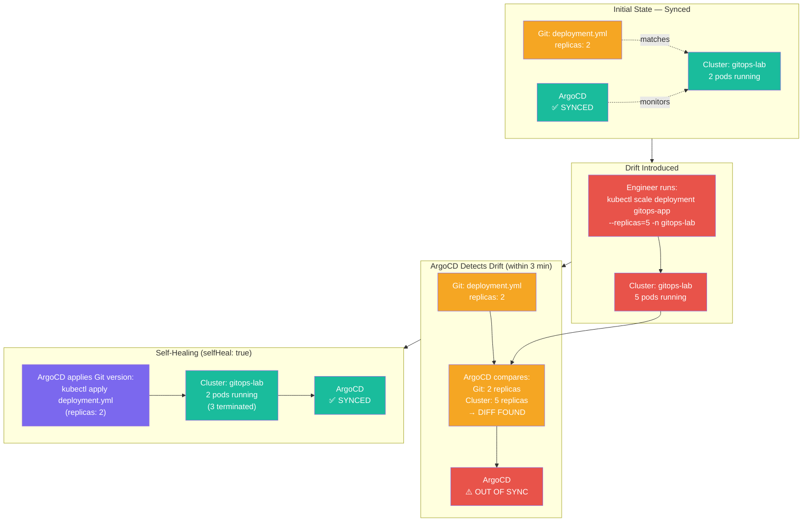

# Hands-On 15 — GitOps: The Cluster Manages Itself

## What This Lab Is About

You've deployed apps manually — `kubectl apply`, `helm upgrade`, direct cluster access. Every change required a human touching the cluster. That's not how production works.

This lab removes the human from the deployment loop entirely.

**GitOps** means Git is the single source of truth for everything that runs in your cluster. No one `kubectl apply`s in production. No one `helm upgrade`s directly. Every change goes through Git. ArgoCD watches Git, detects drift, and syncs the cluster to match. Automatically.

> "If it's not in Git, it doesn't exist. If it's in Git, it will exist in the cluster."

---

## What Changed From Every Previous Lab

| Previous Labs | Hands-On 15 |
|---|---|
| Pipeline deploys via `helm upgrade` or `kubectl apply` | Pipeline only updates a file in Git |
| Humans can edit cluster directly | Any direct edit gets reverted automatically |
| No audit trail of what's running | Git history = complete cluster history |
| Rollback = run pipeline again | Rollback = `git revert` |
| CI and CD in one pipeline | CI in ADO pipeline, CD owned by ArgoCD |

---

## Concepts Covered

- **GitOps** — operational model where Git is the single source of truth for cluster state. Every change is a Git commit. The cluster converges to match Git automatically.
- **ArgoCD** — a GitOps continuous delivery tool that runs inside Kubernetes. Watches a Git repo, compares desired state (Git) with actual state (cluster), and syncs when they differ.
- **Drift Detection** — ArgoCD continuously compares cluster state against Git. Any deviation — whether caused by a manual `kubectl` command or a pod crash — is detected and corrected.
- **Self-Healing** — when `selfHeal: true` is set, ArgoCD automatically reverts any manual changes to the cluster. Git always wins.
- **Auto-sync** — ArgoCD polls Git every 3 minutes by default. When a manifest changes in Git, ArgoCD syncs the cluster without human intervention.
- **Pruning** — when `prune: true` is set, deleting a manifest from Git causes ArgoCD to delete the corresponding resource from the cluster.
- **Application CRD** — ArgoCD's custom resource that defines what Git repo to watch, which path inside it, and which cluster/namespace to deploy to.
- **Manifest Update Pattern** — the CI pipeline's final step patches the image tag in `deployment.yml` and pushes to Git. ArgoCD detects this commit and deploys the new image. No pipeline talks to AKS directly.
- **Managed Identity (MI)** — Azure's credential-free auth mechanism. The ADO pipeline authenticates to Azure (ACR, AKS) without any stored secrets or PATs.

---

## Architecture — End-to-End GitOps Flow



---

## The Two Parallel Tracks Explained

After Provision completes, the pipeline splits into two parallel tracks:

**Track 1: Build → Scan → Push**
Builds the Docker image, scans it for CVEs, pushes the clean image to ACR. Does not touch AKS.

**Track 2: SetupArgoCD**
In parallel with Track 1, installs ArgoCD on AKS via Helm, configures ADO repo credentials using a short-lived MI token, and applies the Application CRD. ArgoCD is now watching Git.

Both tracks must complete before **UpdateManifest** runs. This stage patches the image tag in Git and pushes. ArgoCD is already watching — it picks up the commit and deploys.

---

## What ArgoCD Actually Does

ArgoCD runs inside your AKS cluster as a set of pods in the `argocd` namespace. It is not an external service — it's a workload like anything else you deploy.

Every 3 minutes (default), ArgoCD:
1. Fetches the latest commit from the Git repo path defined in `application.yml`
2. Renders the manifests (for raw YAML, this is just reading the files)
3. Compares the rendered manifests against what's actually in the cluster
4. If they match → **Synced**. Do nothing.
5. If they differ → **OutOfSync**. Apply the Git version to the cluster.

With `selfHeal: true`: if someone runs `kubectl edit` or `kubectl delete` on a managed resource, ArgoCD detects it on the next sync cycle and reverts it.

With `prune: true`: if you remove `service.yml` from Git and push, ArgoCD deletes the Service from the cluster on the next sync.



---

## Why Not Just Use `kubectl apply` in the Pipeline?

| `kubectl apply` in pipeline | ArgoCD GitOps |
|---|---|
| Pipeline must have kubeconfig (credential risk) | ArgoCD runs inside cluster, no external kubeconfig needed |
| No drift detection — cluster can be edited after deployment | Continuous drift detection — cluster always matches Git |
| Rollback = re-run pipeline with old image | Rollback = `git revert` — ArgoCD syncs old state |
| No audit trail of cluster state | Every cluster change is a Git commit |
| Manual intervention if pipeline fails mid-deploy | ArgoCD retries until convergence |
| Multiple pipelines can conflict | Single source of truth — Git wins |

---

## Why Not Use Terraform State for Rollback?

Terraform state tracks **infrastructure existence** — does the AKS cluster exist, what's its node count, what Kubernetes version is it running. It does not track what workloads are running inside the cluster at any given moment.

To track "which version of my app is deployed right now", you'd need to run `terraform apply` on every deployment. Terraform is designed for infrastructure provisioning (slow, stateful operations), not for frequent app releases (fast, declarative operations).

**Layer separation:**
```
Terraform → provisions AKS cluster (the machine)
ArgoCD    → manages what runs inside AKS (the workloads)
```

Terraform builds the house. ArgoCD manages everything that lives inside it.

---

## Why ArgoCD and AKS Auto-scaling Are Not the Same Thing

AKS auto-scaling (HPA) and ArgoCD solve completely different problems:

| | HPA / AKS Auto-scaling | ArgoCD |
|---|---|---|
| **Question it answers** | "How many pods do I need right now?" | "What is allowed to run in this cluster?" |
| **Trigger** | Live metrics (CPU > 70%) | Git diff (manifest changed) |
| **Scope** | Runtime pod count | Desired state of all K8s resources |
| **Manages** | Replicas based on load | Deployments, Services, ConfigMaps, Namespaces |

They work together, not against each other. ArgoCD deploys `replicas: 2` from Git. HPA scales to 8 when traffic spikes. HPA scales back to 2 when traffic drops. ArgoCD rolls out a new image when deployment.yml changes in Git. HPA continues managing count on top of the new image.

ArgoCD owns **what runs**. HPA owns **how many run**.

---

## File Structure

```
Hands-On-15 — GitOps — The Cluster Manages Itself/
├── azure-pipelines.yml                    # CI pipeline: 6 stages, MI auth, no PAT
├── README.md                              # This file
└── Manifest/
    ├── app/
    │   ├── Dockerfile                     # Multi-stage build: builder + runtime
    │   ├── main.py                        # FastAPI app with / and /health endpoints
    │   └── requirements.txt              # fastapi==0.115.12, uvicorn==0.34.0
    ├── argocd/
    │   └── application.yml               # ArgoCD Application CRD — watches k8s-manifests/
    └── k8s-manifests/                    # ArgoCD watches THIS folder
        ├── namespace.yml                 # gitops-lab namespace
        ├── deployment.yml               # 2 replicas, liveness + readiness probes
        └── service.yml                  # LoadBalancer on port 80 → 8000
```

**Critical:** `k8s-manifests/` is the GitOps source of truth. ArgoCD watches only this folder. The pipeline's UpdateManifest stage patches `deployment.yml` inside this folder and pushes to Git. That push is the only deployment mechanism.

---

## File Explanations

### `Manifest/app/main.py` — FastAPI Application

Two endpoints. `/` returns a JSON message confirming GitOps is live. `/health` is used by Kubernetes liveness and readiness probes.

```python
from fastapi import FastAPI

app = FastAPI()

@app.get("/")
def root():
    return {"message": "Hands-On 15 — GitOps is live"}

@app.get("/health")
def health():
    return {"status": "ok"}
```

---

### `Manifest/app/Dockerfile` — Multi-Stage Build

Two stages: `builder` installs dependencies, `runtime` copies only what's needed. The `apt-get upgrade` in runtime patches OS-level CVEs. No dev tools in the final image.

```dockerfile
FROM python:3.12-slim AS builder
WORKDIR /app
COPY requirements.txt .
RUN pip install --no-cache-dir -r requirements.txt

FROM python:3.12-slim AS runtime
RUN apt-get update && apt-get upgrade -y && rm -rf /var/lib/apt/lists/*
WORKDIR /app
COPY --from=builder /usr/local/lib/python3.12/site-packages /usr/local/lib/python3.12/site-packages
COPY --from=builder /usr/local/bin/uvicorn /usr/local/bin/uvicorn
COPY main.py .
EXPOSE 8000
CMD ["uvicorn", "main:app", "--host", "0.0.0.0", "--port", "8000"]
```

The `--target runtime` flag in the pipeline's build command ensures only the runtime stage is tagged and pushed — the builder stage is discarded.

---

### `Manifest/k8s-manifests/namespace.yml`

Isolates the app in its own namespace. ArgoCD applies this first before deployment and service.

```yaml
apiVersion: v1
kind: Namespace
metadata:
  name: gitops-lab
```

---

### `Manifest/k8s-manifests/deployment.yml`

Two replicas with liveness and readiness probes hitting `/health`. Resource requests and limits prevent noisy-neighbour problems. The `image:` field starts as `IMAGE_PLACEHOLDER` — the pipeline patches this with the actual ACR image tag before committing to Git.

```yaml
apiVersion: apps/v1
kind: Deployment
metadata:
  name: gitops-app
  namespace: gitops-lab
spec:
  replicas: 2
  selector:
    matchLabels:
      app: gitops-app
  template:
    metadata:
      labels:
        app: gitops-app
    spec:
      containers:
      - name: app
        image: IMAGE_PLACEHOLDER
        ports:
        - containerPort: 8000
        livenessProbe:
          httpGet:
            path: /health
            port: 8000
          initialDelaySeconds: 5
          periodSeconds: 10
        readinessProbe:
          httpGet:
            path: /health
            port: 8000
          initialDelaySeconds: 3
          periodSeconds: 5
        resources:
          requests:
            cpu: 50m
            memory: 64Mi
          limits:
            cpu: 200m
            memory: 128Mi
```

---

### `Manifest/k8s-manifests/service.yml`

LoadBalancer type assigns an Azure public IP. Port 80 maps to container port 8000. This is what makes the app reachable from outside the cluster.

```yaml
apiVersion: v1
kind: Service
metadata:
  name: gitops-app-svc
  namespace: gitops-lab
spec:
  selector:
    app: gitops-app
  ports:
  - port: 80
    targetPort: 8000
  type: LoadBalancer
```

---

### `Manifest/argocd/application.yml` — The GitOps Wiring

This CRD is what makes ArgoCD watch your repo. Once applied, ArgoCD owns everything in `k8s-manifests/`.

```yaml
apiVersion: argoproj.io/v1alpha1
kind: Application
metadata:
  name: gitops-app
  namespace: argocd
spec:
  project: default
  source:
    repoURL: https://dev.azure.com/manojmanojkumar2513/Hands-On-Labs/_git/Hands-On-Labs
    targetRevision: main
    path: "Kubernetes/Hands-On-15 — GitOps — The Cluster Manages Itself/Manifest/k8s-manifests"
  destination:
    server: https://kubernetes.default.svc
    namespace: gitops-lab
  syncPolicy:
    automated:
      prune: true
      selfHeal: true
    syncOptions:
    - CreateNamespace=true
```

- **`repoURL`** — ADO repo ArgoCD polls every 3 minutes
- **`path`** — folder inside the repo ArgoCD watches for manifests
- **`targetRevision: main`** — track the main branch
- **`selfHeal: true`** — any manual `kubectl` change gets reverted to match Git
- **`prune: true`** — manifests deleted from Git get deleted from the cluster
- **`CreateNamespace=true`** — ArgoCD creates `gitops-lab` if it doesn't exist

---

### `azure-pipelines.yml` — 6-Stage CI Pipeline

#### Stage 0 — Provision
Creates RG, ACR, and AKS via `az` CLI using the MI service connection. Idempotent — safe to rerun. AKS is created with `--attach-acr` so pods can pull images from ACR without pull secrets, and `--enable-oidc-issuer` for workload identity readiness.

#### Stage 1 — Build
Runs on `ubuntu-latest`. Checks out the repo, builds the Docker image targeting only the `runtime` stage, saves it as a `.tar.gz` artifact for the Scan stage. Image is not pushed yet — no point pushing an unscanned image.

#### Stage 2 — Scan
Downloads the image tar, loads it into Docker, installs Trivy, writes `.trivyignore` with known OS-level CVEs that have no upstream fix (all `affected` or `fix_deferred` status in Debian 13), then runs Trivy with `--exit-code 1` — pipeline fails if any unignored HIGH or CRITICAL CVE is found. JSON results published as artifact for audit.

#### Stage 3 — Push
Downloads the same image tar (no rebuild), loads it, logs into ACR via MI (`az acr login`), tags with commit SHA and `latest`, pushes both. Commit SHA tag is immutable — you can always trace exactly which code version is in the registry.

#### Stage 4 — SetupArgoCD (parallel with Build/Scan/Push)
Runs in parallel from Provision. Installs ArgoCD via Helm (`argo/argo-cd`), fetches a short-lived ADO access token from the MI identity (`az account get-access-token --resource 499b84ac-1321-427f-aa17-267ca6975798`), creates a Kubernetes secret ArgoCD uses to clone the private ADO repo, applies `application.yml`. Prints ArgoCD admin password and external IP.

#### Stage 5 — UpdateManifest (requires both Push + SetupArgoCD)
Environment gate: pauses for manual approval on the `production` environment. After approval, runs `sed` to replace the image placeholder in `deployment.yml` with the actual ACR image, commits with `[skip ci]` in the message (prevents infinite trigger loop), and pushes to main. ArgoCD detects this commit within 3 minutes and syncs the cluster.

---

## ADO Setup Required Before Running

### 1. Variable Group: `gitops-lab-vars`

ADO → Pipelines → Library → + Variable group

| Variable | Secret? | Example value |
|---|---|---|
| `serviceConnection` | No | `MI-ADO-API` |
| `resourceGroup` | No | `rg-gitops-lab` |
| `location` | No | `centralindia` |
| `acrName` | No | `acrgitopslab` |
| `acrLoginServer` | No | `acrgitopslab.azurecr.io` |
| `aksCluster` | No | `aks-gitops-lab` |

No PAT needed. MI handles all auth.

### 2. Production Environment with Approval Gate

ADO → Pipelines → Environments → New environment → name: `production`
After creation → Approvals and Checks → + → Approvals → add yourself as approver.

### 3. Build Service Contribute Permission

The UpdateManifest stage does a `git push` from inside the pipeline VM. The ADO Build Service account needs permission to push to the repo.

Project Settings → Repos → Security → `Hands-On-Labs Build Service` → Contribute = **Allow**

This is required because the pipeline is a writer, not just a reader. All previous labs only read from the repo — this lab writes back to it.

---

## How to Verify in Azure Portal

### 1. Resource Group
Portal → Resource Groups → `rg-gitops-lab`
Shows: AKS cluster, ACR, VNet, node resource group

### 2. ACR with Image
Portal → Container Registries → `acrgitopslab` → Repositories → `gitops-app`
Shows: 2 tags — `latest` and the commit SHA

### 3. AKS Workloads
Portal → Kubernetes Services → `aks-gitops-lab` → Workloads → namespace: `gitops-lab`
Shows: Deployment `gitops-app` with 2/2 pods running

### 4. ArgoCD UI
```bash
az aks get-credentials --resource-group rg-gitops-lab --name aks-gitops-lab
kubectl get svc argocd-server -n argocd
```
Open External IP in browser → login: `admin` / password from pipeline logs → Application `gitops-app` shows **Synced / Healthy**

### 5. The App Itself
```bash
kubectl get svc gitops-app-svc -n gitops-lab
```
Open External IP → `{"message": "Hands-On 15 — GitOps is live"}`

---

## Proving GitOps Works — The Drift Test

After the pipeline completes, test self-healing:

```bash
# Manually scale to 5 replicas — bypassing Git
kubectl scale deployment gitops-app --replicas=5 -n gitops-lab

# Watch pods
kubectl get pods -n gitops-lab -w

# Wait 3 minutes (ArgoCD sync interval)
# ArgoCD detects: Git says 2, cluster has 5 — DRIFT
# ArgoCD reverts: scales back to 2 automatically
```



Git said 2. Cluster had 5. ArgoCD wins. Every time.

---

## Cleanup

```bash
az group delete --name rg-gitops-lab --yes --no-wait
```

Deletes everything: AKS, ACR, VNet, node resource group, all workloads inside AKS. `--no-wait` returns immediately — deletion runs in background.

---

## Key Distinctions

| Concept | What It Is |
|---|---|
| GitOps | Git as single source of truth for cluster state. Changes = Git commits. |
| ArgoCD | GitOps CD tool running inside K8s. Polls Git, syncs cluster to match. |
| Application CRD | ArgoCD's resource defining what repo/path to watch and where to deploy |
| `selfHeal: true` | Any drift from Git state is automatically corrected. Git always wins. |
| `prune: true` | Resources deleted from Git are deleted from cluster |
| `[skip ci]` | Commit message flag preventing the pipeline from triggering on its own git push |
| Manifest Update Pattern | Pipeline updates image tag in Git. ArgoCD deploys it. Pipeline never talks to AKS directly. |
| MI token for ADO | `az account get-access-token --resource 499b84ac...` — short-lived bearer token, no PAT needed |
| `persistCredentials: true` | Keeps git credentials on the checkout so the subsequent `git push` works |
| IMAGE_PLACEHOLDER | Marker in deployment.yml replaced by `sed` in UpdateManifest stage |
| Drift | Any difference between Git desired state and actual cluster state |
| Convergence | ArgoCD applying changes until cluster matches Git exactly |

---

## Production Notes

- **Webhook instead of polling** — configure ArgoCD to receive webhooks from ADO on push events. Reduces sync latency from 3 minutes to seconds. ADO → Project Settings → Service Hooks → ArgoCD webhook.
- **App of Apps pattern** — one root ArgoCD Application that deploys other Applications. Used when managing many microservices — one repo, one ArgoCD app per service, root app bootstraps everything.
- **Multiple environments** — separate Git branches or folders (`k8s-manifests/dev/`, `k8s-manifests/prod/`). Separate ArgoCD Applications per environment pointing to different paths.
- **Helm with ArgoCD** — ArgoCD natively supports Helm charts. Point `application.yml` to a Helm chart path, set `helm.valueFiles`, ArgoCD runs `helm template` and applies the output.
- **RBAC on ArgoCD** — in production, engineers have read-only access to ArgoCD UI. Only the pipeline has sync permissions. Nobody manually syncs production.
- **ArgoCD Image Updater** — automatically updates the image tag in Git when a new image is pushed to the registry. Eliminates the UpdateManifest stage entirely — ACR push → ArgoCD Image Updater commits to Git → ArgoCD syncs. Full automation with zero pipeline-to-cluster coupling.
- **Notifications** — ArgoCD Notifications Controller sends Slack/Teams/email alerts when an Application goes OutOfSync, fails to sync, or returns to healthy.
- **Multi-cluster** — a single ArgoCD instance can manage multiple AKS clusters. `destination.server` in `application.yml` points to the target cluster's API endpoint.

---

## What's Next

**Hands-On 16 — Harden, Secure, and Operate Production**

Kyverno (policy enforcement), Trivy (runtime scanning), Pod Security Standards, Azure Key Vault integration via CSI driver, and disaster recovery. You've built the platform. Now you lock it down.