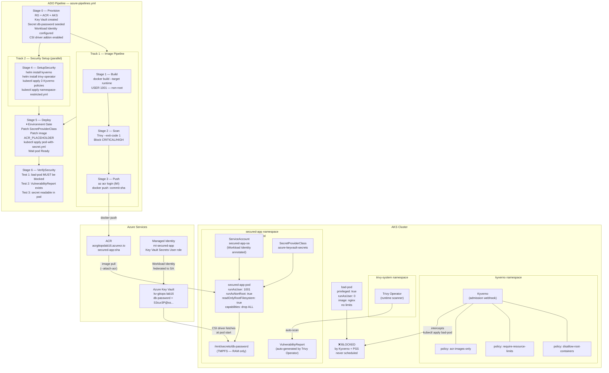
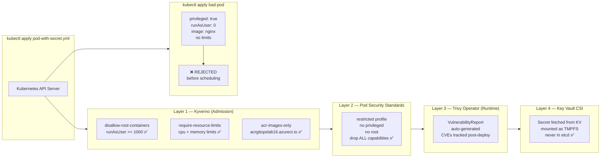
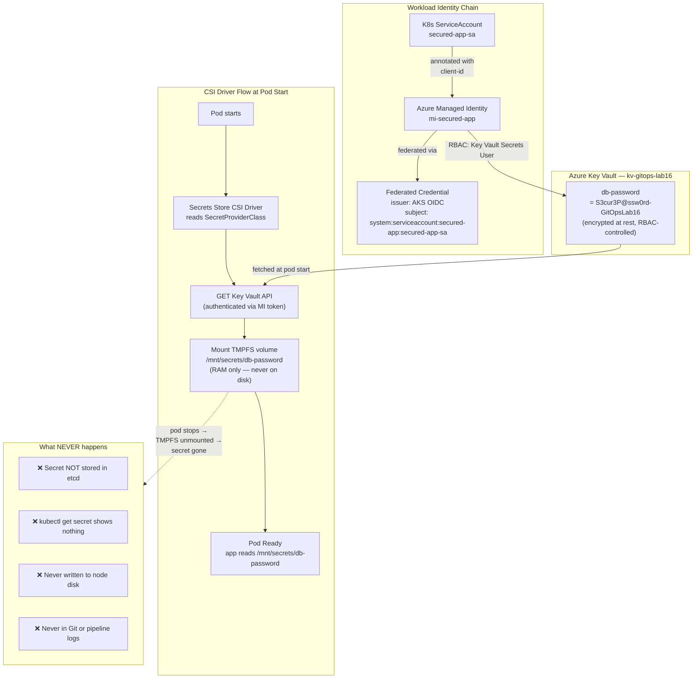

# Hands-On 16 — Harden, Secure, and Operate Production

## What This Lab Is About

You've built the platform, automated deployments with GitOps, and observed everything with Prometheus. But right now, anyone with cluster access can run a container as root, pull images from Docker Hub, skip resource limits, and store passwords in base64-encoded Kubernetes Secrets.

This lab locks all of that down. Four security layers, working together, enforced automatically.

> "Security is not a feature you add at the end. It is a constraint you enforce from the beginning."

---

## What Changed From Every Previous Lab

| Previous Labs | Hands-On 16 |
|---|---|
| Any image from any registry | Only images from your ACR allowed |
| Containers can run as root | Root containers blocked at admission |
| No resource limits required | All containers must declare CPU + memory limits |
| Secrets stored in K8s (base64) | Secrets live in Azure Key Vault only |
| No runtime vulnerability scanning | Trivy Operator scans every running pod |
| Pipeline deploys and hopes | Pipeline deploys AND proves security works |

---

## Concepts Covered

- **Kyverno** — Kubernetes-native policy engine running as an admission webhook. Intercepts every API request before it reaches etcd. If a pod violates a policy, it is rejected before it is ever scheduled.
- **ClusterPolicy** — Kyverno's cluster-wide policy resource. Defines rules that apply across all namespaces (with explicit exclusions for system namespaces).
- **`validationFailureAction: Enforce`** — hard block. Pod rejected at the API server. Alternative is `Audit` — logs the violation but allows the pod. Production always uses `Enforce`.
- **Pod Security Standards (PSS)** — Kubernetes-native security baseline applied via namespace labels. Three profiles: `privileged` (no restrictions), `baseline` (blocks known exploits), `restricted` (production-grade hardening). No extra tool required.
- **Trivy Operator** — runs inside the cluster as a controller. Automatically generates `VulnerabilityReport` CRDs for every running pod. Different from pipeline Trivy (which scans before push) — this scans what is already running.
- **VulnerabilityReport** — Kubernetes CRD created by Trivy Operator. Queryable via `kubectl get vulnerabilityreport`. Contains CVE details per container per pod.
- **Azure Key Vault** — Azure's managed secrets service. Secrets stored here are encrypted at rest, RBAC-controlled, and fully audited. Never stored in Kubernetes.
- **Secrets Store CSI Driver** — bridges Azure Key Vault and Kubernetes. Fetches secrets from Key Vault at pod start time and mounts them as files in a TMPFS volume inside the pod.
- **TMPFS** — in-memory filesystem. Secrets mounted via CSI driver live only in RAM. Never written to disk, never stored in etcd, gone when the pod stops.
- **SecretProviderClass** — CRD that tells the CSI driver which Key Vault, which secrets, and which identity to use.
- **Workload Identity** — Kubernetes ServiceAccount federated to an Azure Managed Identity. Pods authenticate to Azure services (Key Vault) without any stored credentials.
- **Admission Controller** — Kubernetes API server plugin that intercepts requests before they are persisted. Kyverno and PSS both operate as admission controllers.

---

## Architecture — Four Security Layers



---

## How the Four Security Layers Work Together



---

## Key Vault Secret Flow — How TMPFS Works



---

## File Structure

```
Hands-On-16 — Harden, Secure, and Operate Production/
├── azure-pipelines.yml                      # 6-stage CI/CD pipeline with VerifySecurity
├── README.md                                # This file
└── Manifest/
    ├── app/
    │   ├── Dockerfile                       # Multi-stage, non-root USER 1001
    │   ├── main.py                          # FastAPI — /health + /secret endpoints
    │   └── requirements.txt                # fastapi==0.115.12, uvicorn==0.34.0
    ├── kyverno/
    │   ├── policy-no-root.yml              # Block root containers (runAsUser >= 1000)
    │   ├── policy-require-limits.yml       # Require CPU + memory limits on all containers
    │   └── policy-acr-only.yml             # Block images not from acrgitopslab16.azurecr.io
    ├── pod-security/
    │   ├── namespace-restricted.yml        # Label secured-app with PSS restricted profile
    │   └── test-privileged-pod.yml         # Intentionally violating pod — must be BLOCKED
    ├── trivy/
    │   └── trivy-operator-values.yml       # Helm values for Trivy Operator installation
    └── keyvault/
        ├── secretproviderclass.yml         # CSI driver wiring — which KV, which secret
        └── pod-with-secret.yml             # Secured pod — mounts KV secret via CSI
```

---

## File Explanations

### `Manifest/app/Dockerfile` — Non-Root Multi-Stage Build

The key addition vs Lab 15 — creates a non-root user and switches to it before `CMD`. This satisfies both Kyverno's `policy-no-root.yml` and PSS `restricted` profile.

```dockerfile
RUN groupadd -r appgroup && useradd -r -g appgroup -u 1001 appuser
USER appuser
```

UID 1001 satisfies `runAsUser >= 1000` in the Kyverno policy.

---

### `Manifest/kyverno/policy-no-root.yml` — Block Root Containers

`validationFailureAction: Enforce` — hard block, not audit. Pod rejected at API server before scheduling.

```yaml
validate:
  pattern:
    spec:
      containers:
      - securityContext:
          runAsNonRoot: true
          runAsUser: ">= 1000"
```

---

### `Manifest/kyverno/policy-require-limits.yml` — Require Resource Limits

Every container must declare both `cpu` and `memory` limits. Prevents noisy-neighbour problems and OOMKilled cascades on shared nodes.

```yaml
validate:
  pattern:
    spec:
      containers:
      - resources:
          limits:
            cpu: "?*"
            memory: "?*"
```

---

### `Manifest/kyverno/policy-acr-only.yml` — ACR Images Only

Blocks supply chain attacks via public registry images. System namespaces (`kube-system`, `argocd`, `kyverno`, `trivy-system`) are excluded — they pull from public registries legitimately.

```yaml
exclude:
  any:
  - resources:
      namespaces:
      - kube-system
      - argocd
      - kyverno
      - trivy-system
validate:
  pattern:
    spec:
      containers:
      - image: "acrgitopslab16.azurecr.io/*"
```

---

### `Manifest/pod-security/namespace-restricted.yml` — PSS Restricted Profile

Three labels on the namespace. `enforce` rejects violating pods. `audit` logs them. `warn` returns warnings to kubectl. All three set to `restricted`.

```yaml
labels:
  pod-security.kubernetes.io/enforce: restricted
  pod-security.kubernetes.io/audit: restricted
  pod-security.kubernetes.io/warn: restricted
```

---

### `Manifest/pod-security/test-privileged-pod.yml` — The Bad Pod

Intentionally violates all four security controls simultaneously. Used in VerifySecurity Test 1 — pipeline asserts this apply **fails**.

```yaml
securityContext:
  privileged: true    # violates PSS restricted
  runAsUser: 0        # violates policy-no-root
# image: nginx        # violates policy-acr-only
# no resources        # violates policy-require-limits
```

---

### `Manifest/keyvault/secretproviderclass.yml` — CSI Wiring

Tells the CSI driver which Key Vault to connect to, which secret to fetch, and which Managed Identity to use. Placeholders `$(workloadIdentityClientId)` and `$(tenantId)` are patched by the pipeline's Deploy stage via `sed`.

---

### `Manifest/keyvault/pod-with-secret.yml` — Secured Pod

Satisfies all four security layers simultaneously:

```yaml
securityContext:
  runAsNonRoot: true              # Kyverno + PSS
  runAsUser: 1001                 # Kyverno (>= 1000)
  allowPrivilegeEscalation: false # PSS restricted
  capabilities:
    drop:
    - ALL                         # PSS restricted
  readOnlyRootFilesystem: true    # PSS restricted
resources:
  limits:
    cpu: 200m                     # Kyverno require-limits
    memory: 128Mi                 # Kyverno require-limits
volumeMounts:
- mountPath: "/mnt/secrets"       # Key Vault CSI mount
```

`ACR_PLACEHOLDER` in the image field is replaced by `sed` in the Deploy stage with the actual ACR image tag.

---

### `azure-pipelines.yml` — 6-Stage Pipeline

#### Stage 0 — Provision
Creates RG, ACR, AKS with `--enable-workload-identity` and `--enable-addons azure-keyvault-secrets-provider`. Creates Key Vault, seeds `db-password` secret, creates Managed Identity `mi-secured-app`, grants it `Key Vault Secrets User` role, creates K8s ServiceAccount with workload identity annotation, and creates the federated credential linking the SA to the MI via AKS OIDC issuer.

#### Stage 1 — Build
Multi-stage Docker build targeting `runtime` stage. `USER 1001` in Dockerfile ensures the image satisfies Kyverno's non-root policy before it ever hits the cluster.

#### Stage 2 — Scan
Trivy scans the image before push. `.trivyignore` covers known OS-level CVEs with no upstream fix in Debian 13. `--exit-code 1` blocks the pipeline on any unignored HIGH or CRITICAL CVE.

#### Stage 3 — Push
Image pushed to ACR via MI. Tagged with commit SHA (immutable) and `latest` (pointer).

#### Stage 4 — SetupSecurity (parallel with Build/Scan/Push)
Installs Kyverno and Trivy Operator via Helm. Applies all three Kyverno ClusterPolicies. Applies PSS labels to `secured-app` namespace. Uses `BASE` variable for all file paths to handle the em dash in the folder name.

#### Stage 5 — Deploy (environment gate)
Pauses for manual approval on `production` environment. Fetches MI client ID and tenant ID at runtime, patches `secretproviderclass.yml` via `sed`, patches `pod-with-secret.yml` with ACR image, applies both, waits for pod Ready (CSI driver must successfully mount the Key Vault secret).

#### Stage 6 — VerifySecurity
Three automated tests that prove security is working. Pipeline fails if any test fails.

---

## ADO Setup Required Before Running

### Variable Group: `gitops-lab16-vars`

ADO → Pipelines → Library → + Variable group

| Variable | Secret? | Value |
|---|---|---|
| `serviceConnection` | No | `MI-ADO-API` |
| `resourceGroup` | No | `rg-gitops-lab16` |
| `location` | No | `centralindia` |
| `acrName` | No | `acrgitopslab16` |
| `acrLoginServer` | No | `acrgitopslab16.azurecr.io` |
| `aksCluster` | No | `aks-gitops-lab16` |
| `keyVaultName` | No | `kv-gitops-lab16` |

### Production Environment
Reuse the existing `production` environment from Lab 15. Approval gate already configured.

---

## The BASE Variable — Why Not $(basePath)?

The folder name contains an em dash (`—`) and commas. When ADO expands `$(basePath)` inside a bash script, the shell splits the value at the em dash — treating the rest as a separate argument. The path breaks.

Fix: set `BASE` as a bash variable inside each script block. Bash handles special characters inside quoted variable assignments correctly.

```bash
# BROKEN — ADO expands before bash sees it, em dash splits path
kubectl apply -f "$(Build.SourcesDirectory)/$(basePath)/kyverno/policy.yml"

# CORRECT — bash handles the full string including em dash
BASE="$(Build.SourcesDirectory)/Kubernetes/Hands-On-16 — Harden, Secure, and Operate Production/Manifest"
kubectl apply -f "${BASE}/kyverno/policy.yml"
```

---

## VerifySecurity — The Three Tests

### Test 1 — Kyverno + PSS Blocks bad-pod

```bash
kubectl apply -f "${BASE}/pod-security/test-privileged-pod.yml"
# Expected: Error from server (Forbidden) — rejected by admission control
# If apply SUCCEEDS → pipeline exits 1 — SECURITY FAILURE
```

### Test 2 — Trivy Operator Generated VulnerabilityReport

```bash
kubectl get vulnerabilityreport -n secured-app
# Expected: at least 1 report auto-generated by Trivy Operator
# Polls every 10s for 3 minutes — fails if no report appears
```

### Test 3 — Key Vault Secret Mounted in Pod

```bash
kubectl exec secured-app-pod -n secured-app -- cat /mnt/secrets/db-password
# Expected: non-empty value (secret redacted in logs)
# If empty → pipeline exits 1 — CSI integration failed
```

---

## How to Verify in Azure Portal

### 1. Resource Group
Portal → Resource Groups → `rg-gitops-lab16`
Shows: AKS, ACR, Key Vault, Managed Identity, VNet

### 2. Key Vault Secret
Portal → Key Vaults → `kv-gitops-lab16` → Secrets → `db-password`
Shows: secret exists, access logs show CSI driver fetching it at pod start

### 3. ACR Image
Portal → Container Registries → `acrgitopslab16` → Repositories → `secured-app`
Shows: 2 tags — `latest` and commit SHA

### 4. AKS Workloads
Portal → Kubernetes Services → `aks-gitops-lab16` → Workloads → namespace: `secured-app`
Shows: `secured-app-pod` running

### 5. Kyverno Policies
```bash
kubectl get clusterpolicy
kubectl describe clusterpolicy disallow-root-containers
```

### 6. Trivy VulnerabilityReports
```bash
kubectl get vulnerabilityreport -n secured-app
kubectl describe vulnerabilityreport -n secured-app
```

---

## Cleanup

```bash
az group delete --name rg-gitops-lab16 --yes --no-wait
```

Deletes everything: AKS, ACR, Key Vault, Managed Identity, VNet.

---

## Key Distinctions

| Concept | What It Is |
|---|---|
| Kyverno | Admission webhook — rejects non-compliant pods before scheduling |
| `validationFailureAction: Enforce` | Hard block — pod rejected. `Audit` only logs. |
| `background: true` | Kyverno also evaluates existing resources, not just new ones |
| Pod Security Standards | K8s-native security baseline via namespace labels. No tool needed. |
| `restricted` profile | Blocks privileged, root, host network, requires drop ALL capabilities |
| Trivy Operator | Runtime scanner inside cluster. Different from pipeline Trivy (pre-push scan). |
| VulnerabilityReport | CRD auto-created by Trivy Operator per pod. Queryable via kubectl. |
| Azure Key Vault | Secrets encrypted at rest, RBAC-controlled, fully audited. Never in K8s. |
| CSI Driver | Bridges Key Vault and K8s. Fetches secret at pod start. |
| TMPFS | In-memory filesystem. Secret lives in RAM only. Gone when pod stops. |
| SecretProviderClass | CRD telling CSI driver which vault, which secret, which identity |
| Workload Identity | K8s SA federated to Azure MI. No stored credentials anywhere. |
| `ACR_PLACEHOLDER` | Marker in pod-with-secret.yml replaced by `sed` in Deploy stage |
| BASE variable | Bash variable for file paths — avoids em dash breaking path expansion |
| VerifySecurity stage | Automated proof that all 4 security layers work. Pipeline fails if any test fails. |

---

## Production Notes

- **Kyverno `Audit` mode first** — in real migrations, start with `validationFailureAction: Audit` to discover violations without blocking. Switch to `Enforce` after fixing all violations.
- **Kyverno mutation** — beyond validation, Kyverno can mutate resources. Example: auto-inject `runAsNonRoot: true` on any pod that doesn't set it. Useful for teams that forget.
- **PSS vs Kyverno** — PSS covers pod-level security fields only, built-in, zero tooling. Kyverno covers anything: registry enforcement, label requirements, naming conventions, resource quotas. Use both.
- **Trivy Operator reports in CI** — pipe `kubectl get vulnerabilityreport -o json` into your reporting pipeline. Fail deployments if critical CVEs appear in running pods.
- **Key Vault rotation** — CSI driver polls Key Vault periodically (configurable). When secret rotates in Key Vault, mounted file updates automatically — no pod restart needed.
- **Multiple secrets** — `SecretProviderClass` supports multiple objects in the `array`. Add more `objectName` entries to mount additional secrets.
- **Key Vault soft delete** — enabled by default. Deleted secrets recoverable for 90 days. Important for DR.
- **Kyverno PolicyException** — production escape hatch. If a legitimate workload needs to violate a policy (e.g., a DaemonSet needing host network), create a `PolicyException` CRD scoped to that specific resource instead of weakening the global policy.

---

## What's Next

**Hands-On 16 is the final lab.**

You have now built, deployed, observed, automated, and secured a production-grade Kubernetes platform on Azure:

| Lab | What You Built |
|---|---|
| 1–10 | Core K8s — Pods, Deployments, Services, StatefulSets, RBAC, Ingress |
| 11–13 | Networking internals, Jobs, Helm |
| 14 | Observability — Prometheus, Grafana, Alertmanager |
| 15 | GitOps — ArgoCD, drift detection, manifest update pattern |
| 16 | Security — Kyverno, PSS, Trivy Operator, Azure Key Vault |

This is the stack EU/Nordic platform engineering teams run in production.