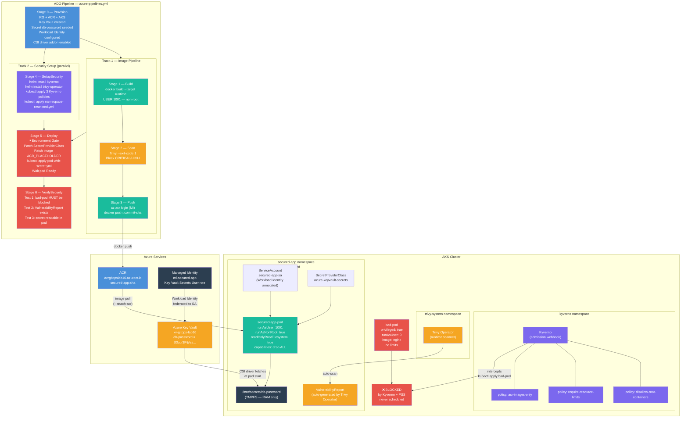
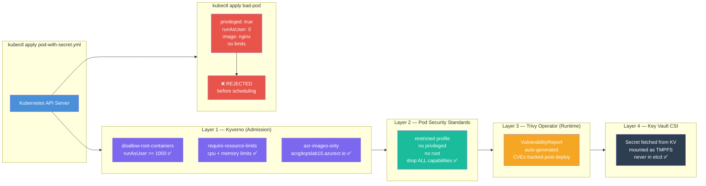
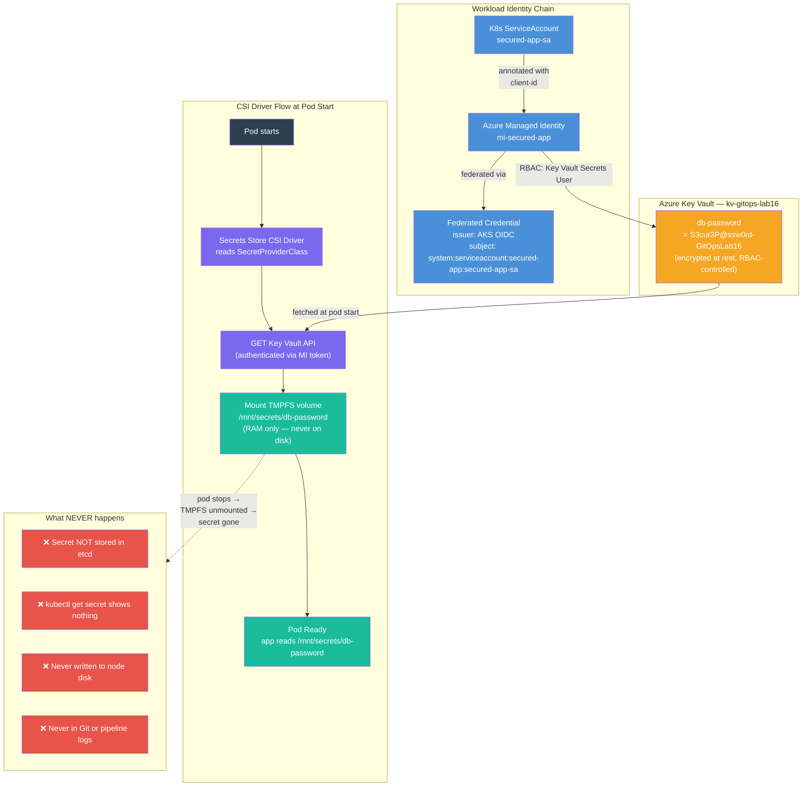

# Hands-On 16 — Harden, Secure, and Operate Production

## What This Lab Is About

You've built the platform, automated deployments with GitOps, and observed everything with Prometheus. But right now, anyone with cluster access can run a container as root, pull images from Docker Hub, skip resource limits, and store passwords in base64-encoded Kubernetes Secrets.

This lab locks all of that down. Four security layers, working together, enforced automatically.

> "Security is not a feature you add at the end. It is a constraint you enforce from the beginning."

---

## What Changed From Every Previous Lab

| Previous Labs | Hands-On 16 |
|---|---|
| Any image from any registry | Only images from your ACR allowed |
| Containers can run as root | Root containers blocked at admission |
| No resource limits required | All containers must declare CPU + memory limits |
| Secrets stored in K8s (base64) | Secrets live in Azure Key Vault only |
| No runtime vulnerability scanning | Trivy Operator scans every running pod |
| Pipeline deploys and hopes | Pipeline deploys AND proves security works |

---

## Concepts Covered

- **Kyverno** — Kubernetes-native policy engine running as an admission webhook. Intercepts every API request before it reaches etcd. If a pod violates a policy, it is rejected before it is ever scheduled.
- **ClusterPolicy** — Kyverno's cluster-wide policy resource. Defines rules that apply across all namespaces (with explicit exclusions for system namespaces).
- **`validationFailureAction: Enforce`** — hard block. Pod rejected at the API server. Alternative is `Audit` — logs the violation but allows the pod. Production always uses `Enforce`.
- **Pod Security Standards (PSS)** — Kubernetes-native security baseline applied via namespace labels. Three profiles: `privileged` (no restrictions), `baseline` (blocks known exploits), `restricted` (production-grade hardening). No extra tool required.
- **Trivy Operator** — runs inside the cluster as a controller. Automatically generates `VulnerabilityReport` CRDs for every running pod. Different from pipeline Trivy (which scans before push) — this scans what is already running.
- **VulnerabilityReport** — Kubernetes CRD created by Trivy Operator. Queryable via `kubectl get vulnerabilityreport`. Contains CVE details per container per pod.
- **Azure Key Vault** — Azure's managed secrets service. Secrets stored here are encrypted at rest, RBAC-controlled, and fully audited. Never stored in Kubernetes.
- **Secrets Store CSI Driver** — bridges Azure Key Vault and Kubernetes. Fetches secrets from Key Vault at pod start time and mounts them as files in a TMPFS volume inside the pod.
- **TMPFS** — in-memory filesystem. Secrets mounted via CSI driver live only in RAM. Never written to disk, never stored in etcd, gone when the pod stops.
- **SecretProviderClass** — CRD that tells the CSI driver which Key Vault, which secrets, and which identity to use.
- **Workload Identity** — Kubernetes ServiceAccount federated to an Azure Managed Identity. Pods authenticate to Azure services (Key Vault) without any stored credentials.
- **Admission Controller** — Kubernetes API server plugin that intercepts requests before they are persisted. Kyverno and PSS both operate as admission controllers.

---

## Architecture — Four Security Layers



---

## How the Four Security Layers Work Together



---

## Key Vault Secret Flow — How TMPFS Works



---

## File Structure

```
Hands-On-16 — Harden, Secure, and Operate Production/
├── azure-pipelines.yml                      # 6-stage CI/CD pipeline with VerifySecurity
├── README.md                                # This file
└── Manifest/
    ├── app/
    │   ├── Dockerfile                       # Multi-stage, non-root USER 1001
    │   ├── main.py                          # FastAPI — /health + /secret endpoints
    │   └── requirements.txt                # fastapi==0.115.12, uvicorn==0.34.0
    ├── kyverno/
    │   ├── policy-no-root.yml              # Block root containers (runAsUser >= 1000)
    │   ├── policy-require-limits.yml       # Require CPU + memory limits on all containers
    │   └── policy-acr-only.yml             # Block images not from acrgitopslab16.azurecr.io
    ├── pod-security/
    │   ├── namespace-restricted.yml        # Label secured-app with PSS restricted profile
    │   └── test-privileged-pod.yml         # Intentionally violating pod — must be BLOCKED
    ├── trivy/
    │   └── trivy-operator-values.yml       # Helm values for Trivy Operator installation
    └── keyvault/
        ├── secretproviderclass.yml         # CSI driver wiring — which KV, which secret
        └── pod-with-secret.yml             # Secured pod — mounts KV secret via CSI
```

---

## File Explanations

### `Manifest/app/Dockerfile` — Non-Root Multi-Stage Build

The key addition vs Lab 15 — creates a non-root user and switches to it before `CMD`. This satisfies both Kyverno's `policy-no-root.yml` and PSS `restricted` profile.

```dockerfile
RUN groupadd -r appgroup && useradd -r -g appgroup -u 1001 appuser
USER appuser
```

UID 1001 satisfies `runAsUser >= 1000` in the Kyverno policy.

---

### `Manifest/kyverno/policy-no-root.yml` — Block Root Containers

`validationFailureAction: Enforce` — hard block, not audit. Pod rejected at API server before scheduling. The `exclude` block lists all system namespaces (`kube-system`, `kyverno`, `trivy-system`) so Trivy Operator's scan jobs — which run as root internally — are not blocked by this policy.

```yaml
exclude:
  any:
  - resources:
      namespaces:
      - kube-system
      - kyverno
      - trivy-system
validate:
  pattern:
    spec:
      containers:
      - securityContext:
          runAsNonRoot: true
          runAsUser: ">= 1000"
```

---

### `Manifest/kyverno/policy-require-limits.yml` — Require Resource Limits

Every container must declare both `cpu` and `memory` limits. Prevents noisy-neighbour problems and OOMKilled cascades on shared nodes.

---

### `Manifest/kyverno/policy-acr-only.yml` — ACR Images Only

Blocks supply chain attacks via public registry images. System namespaces excluded — they pull from public registries legitimately.

---

### `Manifest/pod-security/namespace-restricted.yml` — PSS Restricted Profile

Three labels on the namespace. `enforce` rejects violating pods. `audit` logs them. `warn` returns warnings to kubectl. All three set to `restricted`.

---

### `Manifest/pod-security/test-privileged-pod.yml` — The Bad Pod

Intentionally violates all four security controls simultaneously. Used in VerifySecurity Test 1 — the pipeline asserts this apply **fails**. If it succeeds, the pipeline exits 1.

---

### `Manifest/keyvault/secretproviderclass.yml` — CSI Wiring

Tells the CSI driver which Key Vault, which secret, and which identity to use. Placeholders patched by `sed` in the Deploy stage.

---

### `Manifest/keyvault/pod-with-secret.yml` — Secured Pod

Satisfies all four security layers simultaneously via `securityContext`, resource limits, and CSI volume mount.

---

## VerifySecurity — The Three Tests Explained

This is the most important stage in the pipeline. It does not just deploy and hope. It **proves** each security layer is actually working by running automated assertions. If any test fails, the pipeline exits with code 1.

---

### Test 1 — Kyverno + PSS Blocks bad-pod

**What it does:**

The pipeline deliberately tries to deploy `test-privileged-pod.yml` — a pod that violates every security rule simultaneously:

```yaml
securityContext:
  privileged: true    # full node access — PSS restricted blocks this
  runAsUser: 0        # root — Kyverno disallow-root-containers blocks this
# image: nginx        # public registry — Kyverno acr-images-only blocks this
# no resources        # Kyverno require-resource-limits blocks this
```

**The assertion is inverted — success means failure:**

```bash
if kubectl apply -f "${BASE}/pod-security/test-privileged-pod.yml" 2>&1; then
  echo "SECURITY FAILURE: bad-pod was NOT blocked"
  exit 1
else
  echo "✅ Test 1 PASSED — bad-pod correctly blocked"
fi
```

If `kubectl apply` **succeeds** → security is broken → pipeline fails.
If `kubectl apply` **fails** → security is working → pipeline passes.

**What the rejection looks like in the logs:**
```
Error from server (Forbidden):
admission webhook "validate.kyverno.svc-fail" denied the request:
disallow-root-containers: Containers must not run as root.
Set securityContext.runAsNonRoot: true and runAsUser >= 1000.
```

**Why this matters:** Without this test, you'd deploy security policies and assume they work. A misconfigured Kyverno installation (webhook not registered, policy in Audit mode instead of Enforce) would silently allow bad pods through. This test catches that immediately.

---

### Test 2 — Trivy Operator Generated VulnerabilityReport

**What it does:**

Trivy Operator runs as a controller inside the cluster. When it detects a new pod, it creates a scan Job in `trivy-system`, runs Trivy against the pod's image, and writes the results as a `VulnerabilityReport` CRD in the pod's namespace.

The pipeline polls for this CRD every 10 seconds for up to 3 minutes:

```bash
RETRIES=18
for i in $(seq 1 $RETRIES); do
  REPORT_COUNT=$(kubectl get vulnerabilityreport -n secured-app --no-headers | wc -l)
  if [ "$REPORT_COUNT" -gt "0" ]; then
    echo "✅ Test 2 PASSED — ${REPORT_COUNT} VulnerabilityReport(s) found"
    break
  fi
  sleep 10
done
```

**What a VulnerabilityReport contains:**
```bash
kubectl get vulnerabilityreport -n secured-app
# NAME                              REPOSITORY    TAG       SCANNER   AGE
# pod-secured-app-pod-app           secured-app   b045285   Trivy     2m

kubectl describe vulnerabilityreport -n secured-app
# Lists every CVE found in the running image:
# severity, fixed version, description, links
```

**Pipeline Trivy vs Trivy Operator — the difference:**

| Pipeline Trivy (Stage 2) | Trivy Operator (Test 2) |
|---|---|
| Runs before image is pushed | Runs after pod is deployed |
| Blocks pipeline on CVEs | Reports CVEs as K8s CRDs |
| One-time scan at build time | Continuous — rescans periodically |
| Runs on MS-hosted agent VM | Runs inside AKS as a controller |
| Catches CVEs before cluster | Catches new CVEs after deployment |

Both are needed. Pipeline Trivy blocks at build time. Trivy Operator catches CVEs discovered after the image was deployed — the CVE database updates daily, so a clean image today may have a new CVE next week.

**The Kyverno conflict — what happened in this lab:**
Trivy Operator creates scan Jobs internally to scan pods. Those Jobs run as root. If Kyverno's `disallow-root-containers` policy excludes `trivy-system`, Kyverno blocks those Jobs and Trivy can never produce a report. The fix: always exclude `trivy-system` from the no-root policy.

---

### Test 3 — Key Vault Secret Mounted in Pod

**What it does:**

Reads `/mnt/secrets/db-password` from inside the running pod using `kubectl exec`:

```bash
SECRET_VALUE=$(kubectl exec secured-app-pod \
  -n secured-app -- cat /mnt/secrets/db-password 2>/dev/null)

if [ -z "${SECRET_VALUE}" ]; then
  echo "FAILURE: Secret not mounted. Key Vault CSI integration failed."
  exit 1
else
  echo "✅ Test 3 PASSED — Secret mounted from Azure Key Vault"
  echo "Secret length: ${#SECRET_VALUE} characters (value redacted)"
fi
```

**The full chain this test validates:**

```
Azure Key Vault → secret "db-password" exists
       ↓
Managed Identity → has Key Vault Secrets User RBAC role
       ↓
Federated Credential → K8s SA linked to MI via AKS OIDC issuer
       ↓
SecretProviderClass → tells CSI driver: vault name, secret name, identity
       ↓
pod-with-secret.yml → mounts CSI volume at /mnt/secrets
       ↓
CSI Driver → fetches secret at pod start, mounts as TMPFS file
       ↓
kubectl exec cat → file readable inside pod ← Test 3 checks this
```

If any link breaks — wrong vault name, wrong MI permissions, wrong federated credential subject, wrong namespace in SecretProviderClass — the file is empty or the pod fails to start. The test catches any break.

**Why the value is redacted in logs:**
The pipeline prints `Secret length: N characters` instead of the actual value. This prevents the secret from appearing in ADO pipeline logs, which are accessible to anyone with ADO project access.

**What TMPFS means:**
`kubectl get secret -n secured-app` returns nothing. The secret was never stored in Kubernetes. The file at `/mnt/secrets/db-password` exists only in the pod's RAM — gone the moment the pod stops.

---

### Why All Three Tests Must Pass

| Test | Layer It Proves | What Fails If Skipped |
|---|---|---|
| Test 1 | Admission control enforcing | Misconfigured policy silently allows root containers |
| Test 2 | Runtime scanning active | New CVEs in running images go undetected |
| Test 3 | Secrets from Key Vault only | No proof secrets aren't also stored in etcd somewhere |

---

## ADO Setup Required Before Running

### Variable Group: `gitops-lab16-vars`

| Variable | Secret? | Value |
|---|---|---|
| `serviceConnection` | No | `MI-ADO-API` |
| `resourceGroup` | No | `rg-gitops-lab16` |
| `location` | No | `centralindia` |
| `acrName` | No | `acrgitopslab16` |
| `acrLoginServer` | No | `acrgitopslab16.azurecr.io` |
| `aksCluster` | No | `aks-gitops-lab16` |
| `keyVaultName` | No | `kv-gitops-lab16` |

---

## The BASE Variable — Why Not $(basePath)?

The folder name contains an em dash. ADO expands `$(basePath)` before bash sees it — the shell splits at the em dash. Fix: set `BASE` inside each bash script block.

```bash
# BROKEN
kubectl apply -f "$(Build.SourcesDirectory)/$(basePath)/kyverno/policy.yml"

# CORRECT
BASE="$(Build.SourcesDirectory)/Kubernetes/Hands-On-16 — Harden, Secure, and Operate Production/Manifest"
kubectl apply -f "${BASE}/kyverno/policy.yml"
```

---

## How to Verify in Azure Portal

**Resource Group** → Portal → Resource Groups → `rg-gitops-lab16` — AKS, ACR, Key Vault, MI, VNet.

**Key Vault Secret** → Portal → Key Vaults → `kv-gitops-lab16` → Secrets → `db-password` — secret exists, access logs show CSI driver fetching it.

**ACR Image** → Portal → Container Registries → `acrgitopslab16` → Repositories → `secured-app` — 2 tags: `latest` + commit SHA.

**AKS Workloads** → Portal → Kubernetes Services → `aks-gitops-lab16` → Workloads → namespace: `secured-app` — `secured-app-pod` running.

**Kyverno Policies:**
```bash
kubectl get clusterpolicy
kubectl describe clusterpolicy disallow-root-containers
```

**Trivy VulnerabilityReports:**
```bash
kubectl get vulnerabilityreport -n secured-app
kubectl describe vulnerabilityreport -n secured-app
```

---

## Cleanup

```bash
az group delete --name rg-gitops-lab16 --yes --no-wait
```

---

## Key Distinctions

| Concept | What It Is |
|---|---|
| Kyverno | Admission webhook — rejects non-compliant pods before scheduling |
| `validationFailureAction: Enforce` | Hard block — pod rejected. `Audit` only logs. |
| `background: true` | Kyverno also evaluates existing resources, not just new ones |
| Pod Security Standards | K8s-native security baseline via namespace labels. No tool needed. |
| `restricted` profile | Blocks privileged, root, host network, requires drop ALL capabilities |
| Trivy Operator | Runtime scanner inside cluster. Different from pipeline Trivy (pre-push scan). |
| VulnerabilityReport | CRD auto-created by Trivy Operator per pod. Queryable via kubectl. |
| Azure Key Vault | Secrets encrypted at rest, RBAC-controlled, fully audited. Never in K8s. |
| CSI Driver | Bridges Key Vault and K8s. Fetches secret at pod start. |
| TMPFS | In-memory filesystem. Secret lives in RAM only. Gone when pod stops. |
| SecretProviderClass | CRD telling CSI driver which vault, which secret, which identity |
| Workload Identity | K8s SA federated to Azure MI. No stored credentials anywhere. |
| `ACR_PLACEHOLDER` | Marker in pod-with-secret.yml replaced by `sed` in Deploy stage |
| BASE variable | Bash variable for file paths — avoids em dash breaking path expansion |
| VerifySecurity stage | Automated proof that all 4 security layers work. Pipeline fails if any test fails. |
| Kyverno + trivy-system exclude | Required so Trivy Operator's scan jobs (which run as root) are not blocked by the no-root policy |

---

## Production Notes

- **Kyverno `Audit` mode first** — in real migrations, start with `Audit` to discover violations without blocking. Switch to `Enforce` after fixing all violations.
- **Kyverno mutation** — beyond validation, Kyverno can auto-inject `runAsNonRoot: true` on any pod that doesn't set it.
- **PSS vs Kyverno** — PSS covers pod-level security fields only, built-in, zero tooling. Kyverno covers anything. Use both.
- **Trivy Operator reports in CI** — pipe `kubectl get vulnerabilityreport -o json` into your reporting pipeline. Fail deployments if critical CVEs appear in running pods.
- **Key Vault rotation** — CSI driver polls Key Vault periodically. When secret rotates in Key Vault, mounted file updates automatically — no pod restart needed.
- **Kyverno PolicyException** — production escape hatch for legitimate violations. Scoped to a specific resource — doesn't weaken the global policy.

---

## What's Next

**Hands-On 16 is the final lab.**

| Lab | What You Built |
|---|---|
| 1–10 | Core K8s — Pods, Deployments, Services, StatefulSets, RBAC, Ingress |
| 11–13 | Networking internals, Jobs, Helm |
| 14 | Observability — Prometheus, Grafana, Alertmanager |
| 15 | GitOps — ArgoCD, drift detection, manifest update pattern |
| 16 | Security — Kyverno, PSS, Trivy Operator, Azure Key Vault |

--This is the stack EU/Nordic platform engineering teams run in production.--